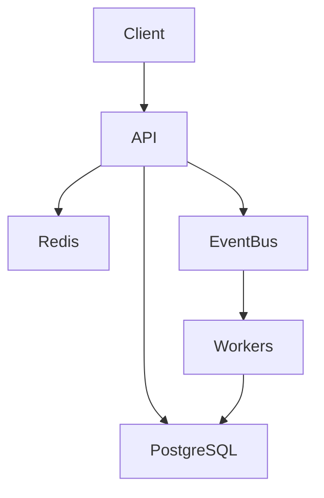

# CareerOS — Master Product & Engineering Specification
## AI Coding Agent Instructions / Project Constitution

**Document status:** Master specification  
**Project:** CareerOS  
**Primary goal:** Build a genuinely useful career platform for HBCU students that can start at Grambling State University, acquire real users, and progressively evolve into a production-grade distributed backend system.

---

# 0. EXECUTIVE SUMMARY

CareerOS is a career operating system for HBCU students.

The core product loop is:

> **Discover → Save → Apply → Track → Improve**

CareerOS should help students:

1. Discover relevant internships, jobs, scholarships, fellowships, hackathons, conferences, research programs, and other career opportunities.
2. Build a student career profile.
3. Receive relevant opportunity recommendations.
4. Save opportunities.
5. Track applications through a complete pipeline.
6. Receive deadline reminders and useful notifications.
7. Eventually understand their application performance through analytics.
8. Potentially allow organizations to submit opportunities.
9. Eventually support aggregate, privacy-safe insights about career opportunities and recruiting outcomes.

The project has TWO equally important goals:

### Product goal
Build something real students can actually use.

### Engineering goal
Use genuine product requirements to develop strong software engineering and distributed-systems depth.

The system should NOT be a distributed system merely because distributed systems look impressive on a resume.

Distributed architecture should be introduced when it solves a real product or scale/reliability problem.

---

# 1. PRODUCT VISION

## 1.1 Vision

Build a trusted career infrastructure platform designed around the needs of HBCU students.

The initial target is:

> Grambling State University students.

The platform should eventually be capable of expanding to other HBCUs.

Potential future users include:

- Students
- Student organizations
- University career centers
- Employers
- Nonprofits
- Program organizers
- Hackathon organizers
- Fellowship/program administrators

---

# 2. CORE PRODUCT PRINCIPLES

The following principles are mandatory.

## 2.1 Real users over artificial complexity

Do not build features solely because they sound impressive.

Before introducing infrastructure complexity, ask:

> What real product requirement does this solve?

## 2.2 Start narrow

Initial product scope should focus on Grambling State University.

Do not initially attempt to support every HBCU.

## 2.3 Build the MVP first

The first usable product should allow a student to:

- create an account
- create a profile
- browse opportunities
- search/filter opportunities
- view opportunity details
- save an opportunity
- track an application
- update application status
- see deadlines

Only after the core loop works should additional distributed infrastructure be introduced.

## 2.4 AI is optional, not the product identity

Do not position CareerOS as an "AI wrapper."

AI may later support:

- opportunity summarization
- profile-to-opportunity matching
- recommendation explanations
- resume/job matching
- personalized insights

But the core product must remain useful without AI.

## 2.5 No fabricated impact

Never invent:

- user counts
- application counts
- throughput
- latency
- error rates
- match accuracy
- uptime
- cost savings
- adoption
- interview outcomes

All metrics must come from actual measurements or real product usage.

---

# 3. TARGET USER

## Primary user

An HBCU student seeking career opportunities.

Example:

- Computer Science major
- Undergraduate
- Looking for SWE internships
- Interested in AI, backend, cloud, and software engineering
- Needs to track many applications
- Often discovers opportunities across fragmented platforms

---

# 4. THE PROBLEM

Students frequently encounter career opportunities across many disconnected sources.

Examples include:

- Company career pages
- University career systems
- Student organizations
- Professional organizations
- Conferences
- Fellowships
- Hackathons
- Research programs
- Public opportunity feeds
- Employer submissions

The student problem is:

> Information is fragmented, deadlines are easy to miss, and application tracking is often handled manually through spreadsheets, notes, browser tabs, or memory.

CareerOS should centralize the workflow.

---

# 5. CORE USER JOURNEY

A student should be able to:

```text
Create account
    ↓
Build career profile
    ↓
Discover opportunities
    ↓
Filter/search
    ↓
View opportunity
    ↓
Save opportunity
    ↓
Apply externally
    ↓
Track application
    ↓
Receive deadline reminders
    ↓
Update application status
    ↓
Review application analytics
    ↓
Improve future applications
```

---

# 6. MVP FEATURES

## 6.1 Authentication

Support:

- Account creation
- Login
- Logout
- Password reset
- Session management
- Secure password handling

Future:

- University email verification
- OAuth
- Google sign-in
- Microsoft sign-in

Do not over-engineer authentication during MVP.

---

# 7. STUDENT PROFILE

Profile fields should be thoughtfully designed.

Potential fields:

- Name
- University
- Major
- Graduation year
- Career interests
- Desired roles
- Skills
- Technologies
- Preferred locations
- Work arrangement
- Experience level
- Resume metadata
- Optional portfolio/GitHub/LinkedIn references

Do NOT collect unnecessary sensitive personal information.

Privacy should be a first-class concern.

---

# 8. OPPORTUNITY MODEL

CareerOS should support opportunity categories such as:

- Internship
- Full-time
- Part-time
- Fellowship
- Scholarship
- Research
- Hackathon
- Conference
- Apprenticeship
- Leadership program
- Other

Opportunity fields may include:

- Title
- Organization
- Description
- Category
- Location
- Remote/hybrid/on-site
- Deadline
- Start date
- Eligibility
- Skills
- Compensation if publicly available
- Application URL
- Source
- Date discovered
- Last verified
- Status/open/closed
- Tags

---

# 9. OPPORTUNITY DISCOVERY

Students should be able to:

- Browse
- Search
- Filter
- Sort
- Save
- View details

Useful filters:

- Role
- Category
- Location
- Remote
- Deadline
- Major/eligibility
- Skills
- Organization
- Opportunity type

Potential future feature:

> "Closing soon"

Example:

```text
Closing in 2 days
Closing this week
Closing this month
```

---

# 10. APPLICATION TRACKER

This is a CORE feature.

A student should be able to track:

```text
Saved
↓
Preparing
↓
Applied
↓
OA / Assessment
↓
Interview
↓
Final Round
↓
Offer
```

Also support terminal states such as:

- Rejected
- Withdrawn
- Closed

Application record should include:

- Opportunity
- Student
- Current status
- Date applied
- Notes
- Next action
- Next action date
- Interview date if applicable
- Optional compensation information
- Status history

Every meaningful status change should be timestamped.

---

# 11. APPLICATION ANALYTICS

Once enough data exists, provide useful personal analytics.

Example:

```text
Applications: 24
Interviews: 6
Offers: 2

Interview rate: 25%
Offer rate: 8.3%
```

Additional future insights:

- Applications by month
- Applications by role
- Applications by company type
- Interview conversion
- Offer conversion
- Deadlines missed
- Most active application periods

Never imply statistical significance when sample sizes are tiny.

---

# 12. RECOMMENDATION ENGINE

The recommendation engine should begin simple.

Do NOT start with an unnecessarily complicated ML model.

Initial matching can use weighted signals such as:

```text
Skills overlap
Role preference
Location preference
Graduation eligibility
Opportunity type
Experience level
Career interests
```

Example:

```text
92% Match

✓ Python
✓ AWS
✓ SQL
✓ Backend interest
✓ Eligible graduation year
```

Recommendations must be explainable.

Avoid black-box recommendations when a simple scoring model works.

Future:

- behavioral recommendations
- collaborative filtering
- learning-to-rank
- ML ranking
- feedback loops

---

# 13. DEADLINE AND NOTIFICATION SYSTEM

Useful notifications include:

- Application deadline approaching
- Saved opportunity closing soon
- Upcoming interview
- Application follow-up reminder
- Status update
- New recommended opportunity

Notification architecture should eventually be asynchronous.

Example:

```text
Deadline approaching
        ↓
Event
        ↓
Queue
        ↓
Notification Worker
        ↓
Email / In-app notification
```

---

# 14. OPPORTUNITY INGESTION

This is one of the primary sources of distributed-system complexity.

CareerOS should eventually ingest opportunities from multiple legitimate sources.

Potential sources:

- Official APIs
- Public feeds
- Public datasets
- Employer submissions
- University submissions
- Student organization submissions
- Manually curated opportunities

DO NOT build the product around scraping websites that prohibit scraping.

Do not bypass:

- authentication
- rate limits
- CAPTCHAs
- access controls
- robots restrictions
- anti-bot systems

Prefer official and authorized sources.

---

# 15. INGESTION ARCHITECTURE

Long-term architecture:

```text
Source A ─┐
Source B ─┤
Source C ─┤
Employer ─┤
University┤
Manual ───┘
     ↓
Ingestion API
     ↓
Message Broker
     ↓
Processing Workers
     ↓
Normalization
     ↓
Deduplication
     ↓
Validation
     ↓
PostgreSQL
```

Workers should be horizontally scalable.

---

# 16. DEDUPLICATION

The same opportunity may appear through multiple sources.

Example:

```text
Company website
University portal
Student organization
Public feed
```

These may represent the same underlying opportunity.

The system should detect likely duplicates.

Potential signals:

- Organization
- Normalized title
- Application URL
- Deadline
- Location
- Description similarity

Start with deterministic rules.

Only introduce fuzzy matching when needed.

---

# 17. EVENT-DRIVEN ARCHITECTURE

CareerOS should eventually use events for loosely coupled workflows.

Example:

```text
ApplicationCreated
        ↓
Event Bus
        ├── Analytics Worker
        ├── Notification Worker
        └── Recommendation Worker
```

Another example:

```text
OpportunityCreated
        ↓
Event Bus
        ├── Search Index Worker
        ├── Recommendation Worker
        └── Analytics Worker
```

The originating service should not need synchronous calls to every downstream consumer.

---

# 18. MESSAGE DELIVERY

Use at-least-once delivery semantics where appropriate.

This means consumers MUST be designed for duplicate messages.

Example:

```text
Message A
    ↓
Worker
    ↓
Database write succeeds
    ↓
Worker crashes before acknowledgement
    ↓
Message A delivered again
```

Consumer must avoid duplicate side effects.

Implement idempotency.

---

# 19. IDEMPOTENCY

Every event with externally meaningful side effects should have an idempotency strategy.

Potential approaches:

- Event IDs
- Idempotency keys
- Unique database constraints
- Redis keys with TTL
- Processed-event table

Do not blindly rely on Redis for permanent correctness.

Database constraints should protect important invariants.

---

# 20. RETRIES

Transient failures should be retried.

Use:

- bounded retries
- exponential backoff
- jitter where appropriate

Avoid infinite retries.

Example:

```text
Attempt 1 → fail
Attempt 2 → fail
Attempt 3 → fail
        ↓
Dead Letter Queue
```

---

# 21. DEAD LETTER QUEUE

Messages that cannot be processed after retry limits should move to a DLQ.

Admin functionality should eventually allow:

- Inspect failed message
- View error reason
- View retry count
- Replay message
- Discard message

DLQ replay should itself be safe and idempotent.

---

# 22. CACHING

Use Redis only where caching provides a measurable benefit.

Potential cache targets:

- popular opportunity searches
- opportunity details
- user recommendation results
- rate limits
- ephemeral deduplication data

Cache strategy must define:

- TTL
- invalidation
- fallback behavior
- behavior when Redis is unavailable

The database remains the source of truth for durable state.

---

# 23. DATABASE

PostgreSQL should be the primary relational database.

Potential entities:

```text
users
student_profiles
organizations
opportunities
opportunity_sources
applications
application_status_history
saved_opportunities
notifications
events
processed_events
audit_logs
```

Use appropriate:

- primary keys
- foreign keys
- indexes
- unique constraints
- transactions

Do not prematurely normalize every possible field.

Design around actual query patterns.

---

# 24. DATABASE INDEXING

Index based on real access patterns.

Likely examples:

- opportunity deadline
- opportunity category
- organization
- location
- application student ID
- application status
- saved opportunity student ID

Benchmark before and after significant indexing changes.

Never claim a performance improvement without measuring it.

---

# 25. CONCURRENCY

Potential concurrency challenges:

- Two workers processing the same event
- Two ingestion jobs discovering the same opportunity
- Concurrent application status updates
- Multiple users saving an opportunity simultaneously
- Multiple workers processing notification jobs

Use appropriate mechanisms:

- database transactions
- unique constraints
- optimistic concurrency where useful
- locks only when necessary
- idempotency

Document race conditions discovered during development.

---

# 26. RATE LIMITING

Implement rate limits for:

- public APIs
- authentication endpoints
- opportunity ingestion
- administrative APIs
- expensive search/recommendation operations

Redis may be used for distributed rate limiting.

Gracefully handle rate-limit failures.

---

# 27. SEARCH

Start with PostgreSQL search if sufficient.

Do NOT introduce Elasticsearch/OpenSearch simply because it sounds impressive.

If real product scale requires dedicated search, evaluate:

- OpenSearch
- Elasticsearch
- Meilisearch
- PostgreSQL full-text search

Document the decision.

---

# 28. OBSERVABILITY

CareerOS must eventually be observable.

Implement:

### Logs

Structured logs containing useful context.

Examples:

- request ID
- user ID where appropriate
- service
- event ID
- operation
- error
- duration

Never log:

- passwords
- secrets
- tokens
- unnecessary personal information

### Metrics

Examples:

- requests/sec
- request latency
- p50/p95/p99
- error rate
- queue depth
- worker utilization
- database latency
- cache hit rate
- ingestion success/failure
- recommendation latency

### Traces

Use OpenTelemetry when service boundaries justify it.

---

# 29. HEALTH CHECKS

Each service should eventually expose appropriate health endpoints.

Distinguish:

- liveness
- readiness

Do not make liveness checks depend on every downstream dependency.

---

# 30. FAILURE INJECTION

CareerOS should eventually be deliberately breakable.

Examples:

- Kill worker
- Stop Redis
- Stop database
- Inject message-processing failure
- Delay worker response
- Drop messages in a test environment
- Simulate source outage

Document:

```text
Failure
→ Detection
→ Recovery
→ User impact
```

This is for development/testing only.

Never expose destructive controls publicly.

---

# 31. LOAD TESTING

Use real load tests.

Potential tool:

- k6

Measure:

- throughput
- p50
- p95
- p99
- error rate
- CPU
- memory
- queue lag

Start with realistic workloads.

Do not select a target such as "10k events/sec" solely for resume value.

Let the benchmark determine actual capacity.

---

# 32. PERFORMANCE ENGINEERING

The process should be:

```text
Measure
↓
Identify bottleneck
↓
Form hypothesis
↓
Optimize
↓
Benchmark again
↓
Document result
```

Potential bottlenecks:

- database writes
- inefficient queries
- network calls
- serialization
- worker concurrency
- queue throughput
- cache misses

Never optimize without evidence.

---

# 33. CLOUD DEPLOYMENT

Start locally.

Eventually deploy to AWS.

Potential architecture:

```text
AWS
│
├── Compute
├── PostgreSQL
├── Redis
├── Object storage if needed
├── Monitoring
└── Networking
```

Do not use expensive managed services without understanding why.

Prefer low-cost/free-tier-compatible infrastructure during development.

---

# 34. CONTAINERIZATION

Use Docker.

Initially:

```text
docker compose
```

for local development.

Services may include:

- API
- PostgreSQL
- Redis
- message broker
- worker(s)
- observability stack

Do not introduce Kubernetes until there is a real reason.

If Kubernetes is introduced, document why.

---

# 35. TECHNOLOGY DIRECTION

Recommended primary backend language:

> **Go**

Reason:

- Strong concurrency model
- Excellent networking libraries
- Good fit for backend infrastructure
- Adds systems/backend depth to the developer's portfolio

Potential stack:

### Frontend
- React
- TypeScript

### Backend
- Go

### Database
- PostgreSQL

### Cache
- Redis

### Messaging
- Kafka, NATS, or another appropriate broker

Do not choose a technology merely because it appears on job descriptions.

### Infrastructure
- Docker
- AWS

### Observability
- Prometheus
- Grafana
- OpenTelemetry

### Load testing
- k6

### CI/CD
- GitHub Actions or another appropriate CI system

---

# 36. SERVICE BOUNDARIES

Potential long-term services:

## API Gateway
Responsibilities:

- authentication
- request routing
- rate limiting
- API-level concerns

## User Service
Responsibilities:

- user accounts
- student profiles

## Opportunity Service
Responsibilities:

- opportunity CRUD
- search/filter
- opportunity lifecycle

## Application Service
Responsibilities:

- save opportunity
- create application
- status changes
- application history

## Ingestion Service
Responsibilities:

- source ingestion
- normalization
- validation

## Recommendation Service
Responsibilities:

- matching
- ranking
- recommendation explanations

## Notification Service
Responsibilities:

- deadlines
- reminders
- email/in-app notifications

## Analytics Service
Responsibilities:

- derived analytics
- aggregate statistics

IMPORTANT:

Do not implement all services at once.

Start as a modular monolith if that makes development faster and safer.

Extract services only when boundaries become justified.

---

# 37. MODULAR MONOLITH FIRST

The initial architecture should likely be:

```text
React
  ↓
Go API
  ↓
PostgreSQL
  ↓
Redis
```

Internally organize code by domain:

```text
users/
opportunities/
applications/
notifications/
recommendations/
```

Later extract asynchronous workers/services.

This reduces premature distributed-system complexity.

---

# 38. SECURITY

Security is mandatory.

Implement:

- password hashing
- secure sessions/tokens
- authorization
- input validation
- rate limiting
- secure secrets management
- HTTPS in production
- least privilege
- audit logging for sensitive administrative actions

Never commit secrets.

Never place credentials in source code.

Use environment variables locally and proper secret management in production.

---

# 39. PRIVACY

CareerOS may contain personal career information.

Treat privacy seriously.

Collect only what is necessary.

Do not publicly expose:

- student application history
- private notes
- resumes
- personal contact details
- private analytics

Aggregate analytics must be privacy-conscious.

Avoid publishing statistics for extremely small groups where individuals could reasonably be inferred.

---

# 40. ADMIN SYSTEM

Eventually provide an internal/admin interface for:

- reviewing opportunities
- approving organization submissions
- managing duplicate opportunities
- viewing ingestion failures
- replaying DLQ events
- closing stale opportunities
- managing reports

Admin functionality must have strong authorization.

Never expose operational controls to ordinary students.

---

# 41. ORGANIZATION SUBMISSIONS

Future feature:

Organizations can submit opportunities.

Flow:

```text
Organization
    ↓
Submit Opportunity
    ↓
Validation
    ↓
Moderation
    ↓
Approved
    ↓
Published
```

Potential organizations:

- student organizations
- universities
- employers
- nonprofits
- program organizers

---

# 42. REAL-WORLD VALIDATION PLAN

Initial validation should happen at Grambling State University.

Do NOT wait until the entire platform is finished.

### Phase 1
Interview students.

Questions:

- How do you currently find internships?
- Where do you keep track of applications?
- What causes you to miss deadlines?
- Which sources do you use?
- What do you dislike about the current process?
- Would a centralized tracker be useful?

### Phase 2
Build MVP.

### Phase 3
Recruit 5–10 pilot users.

### Phase 4
Observe actual usage.

### Phase 5
Iterate.

### Phase 6
Expand to more students.

Only after product validation should broader HBCU expansion be prioritized.

---

# 43. PRODUCT METRICS

Potential real metrics:

### Acquisition
- Registered students
- Active students

### Engagement
- Opportunities viewed
- Opportunities saved
- Applications tracked
- Weekly/monthly active users

### Outcome
- Interviews reported
- Offers reported

Be careful:

These are user-reported unless independently verified.

Do not claim CareerOS caused an interview or offer unless there is strong evidence.

---

# 44. ENGINEERING METRICS

Potential metrics:

- API throughput
- p95 latency
- p99 latency
- queue throughput
- queue lag
- ingestion success rate
- worker failure rate
- cache hit rate
- database query latency
- recovery time

Keep product metrics and infrastructure metrics separate.

---

# 45. DESIGN DOCUMENT

Maintain `docs/DESIGN.md`.

It should contain:

## Requirements

Functional and non-functional.

## Architecture

System diagram.

## Data model

Major entities and relationships.

## Event model

Event names and schemas.

## Failure modes

What can fail?

## Consistency

Where is strong consistency required?

Where is eventual consistency acceptable?

## Delivery semantics

At-most-once vs at-least-once.

## Tradeoffs

Examples:

- PostgreSQL vs NoSQL
- synchronous vs asynchronous
- Redis vs database
- monolith vs microservices
- Kafka vs NATS
- local vs managed cloud services

## Scaling

What changes at:

- 100 users
- 1,000 users
- 10,000 users
- 100,000 users

## 100x scale

Explain what would need to change if traffic increased dramatically.

---

# 46. ARCHITECTURE DIAGRAM

Maintain an up-to-date architecture diagram.

Prefer a format that can be version-controlled, such as Mermaid.

Example:



The diagram must reflect reality.

Do not allow documentation to become fictional.

---

# 47. TESTING STRATEGY

Implement:

## Unit tests
For:

- matching
- validation
- parsing
- domain logic

## Integration tests
For:

- API + database
- event processing
- Redis
- message broker

## End-to-end tests
For:

```text
Register
→ Profile
→ Discover
→ Save
→ Apply
→ Track
```

## Failure tests

Test:

- duplicate event
- worker crash
- database failure
- Redis failure
- message retry
- DLQ behavior

---

# 48. CI/CD

CI should eventually run:

- formatting
- linting
- unit tests
- integration tests
- security checks where practical
- build
- container build

Deployment should occur only after CI succeeds.

---

# 49. REPOSITORY STRUCTURE

A possible structure:

```text
careeros/
│
├── apps/
│   ├── web/
│   └── api/
│
├── services/
│   ├── ingestion/
│   ├── recommendation/
│   ├── notification/
│   └── analytics/
│
├── packages/
│
├── infrastructure/
│   ├── docker/
│   ├── terraform/
│   └── aws/
│
├── docs/
│   ├── DESIGN.md
│   ├── ARCHITECTURE.md
│   ├── FAILURE_TESTING.md
│   ├── BENCHMARKS.md
│   └── ADRs/
│
├── tests/
│
├── load-tests/
│
├── scripts/
│
├── .github/
│
├── AGENTS.md
└── README.md
```

This is only a starting point.

The agent should simplify it if a smaller structure is more appropriate.

---

# 50. ARCHITECTURE DECISION RECORDS

Maintain `docs/ADRs/`.

Every major architectural decision should have a short ADR.

Examples:

```text
ADR-001: Modular monolith for MVP
ADR-002: PostgreSQL as source of truth
ADR-003: Redis caching strategy
ADR-004: Event-driven application notifications
ADR-005: At-least-once event processing
ADR-006: Opportunity deduplication strategy
ADR-007: Message broker selection
```

Each ADR should explain:

- Context
- Decision
- Alternatives
- Tradeoffs
- Consequences

---

# 51. DEVELOPMENT PHASES

## PHASE 0 — Discovery

Before coding:

- Validate problem
- Identify first users
- Define MVP
- Write requirements

Deliverables:

- `docs/PRODUCT.md`
- `docs/REQUIREMENTS.md`

---

## PHASE 1 — Foundation

Build:

- repository
- React frontend
- Go backend
- PostgreSQL
- authentication
- student profiles

Deliverable:

A student can create an account and profile.

---

## PHASE 2 — Opportunity System

Build:

- opportunity model
- browse
- search
- filtering
- opportunity detail
- save opportunity

Deliverable:

Student can discover and save opportunities.

---

## PHASE 3 — Application Tracker

Build:

- application creation
- statuses
- status history
- notes
- deadlines
- dashboard

Deliverable:

Student can manage applications without a spreadsheet.

---

## PHASE 4 — Notifications

Build:

- deadline detection
- reminders
- notification preferences

Start synchronously if necessary.

Later make it event-driven.

---

## PHASE 5 — Opportunity Ingestion

Build:

- ingestion interface
- authorized source adapters
- normalization
- validation
- deduplication

Introduce async workers.

---

## PHASE 6 — Event Architecture

Introduce:

- message broker
- events
- consumers
- idempotency
- retries
- DLQ

Only after the product actually needs asynchronous processing.

---

## PHASE 7 — Recommendation Engine

Start with deterministic scoring.

Add explainability.

Only later consider ML.

---

## PHASE 8 — Observability

Add:

- structured logs
- Prometheus
- Grafana
- OpenTelemetry

Measure the system.

---

## PHASE 9 — Failure Engineering

Introduce:

- worker failures
- dependency failures
- retry testing
- DLQ testing
- recovery testing

Document results.

---

## PHASE 10 — Load Testing

Create realistic synthetic workloads.

Benchmark:

- baseline
- optimized system
- scaling behavior

Store results in:

`docs/BENCHMARKS.md`

---

## PHASE 11 — Cloud Deployment

Deploy to AWS.

Start small.

Use infrastructure-as-code when practical.

---

## PHASE 12 — Real Pilot

Deploy for actual students.

Collect feedback.

Fix problems.

Measure adoption.

---

# 52. WHAT THE AI CODING AGENT MUST NOT DO

Do NOT:

- fabricate metrics
- fabricate user adoption
- claim features are complete when they aren't
- introduce unnecessary technologies
- create microservices without justification
- add dependencies without explaining why
- rewrite large parts of the codebase unnecessarily
- delete working functionality without approval
- store secrets in code
- scrape prohibited sources
- expose private student data
- over-engineer the MVP
- optimize without benchmarks
- claim distributed behavior without actually implementing it
- generate fake tests that do not test meaningful behavior

---

# 53. HOW THE AI AGENT SHOULD WORK

The AI coding agent is a senior engineering assistant, not an autonomous code generator.

For meaningful features, follow this workflow:

```text
Understand
↓
Plan
↓
Explain design
↓
Identify tradeoffs
↓
Identify failure modes
↓
Implement
↓
Test
↓
Review
↓
Measure
↓
Document
```

Before large changes, provide:

1. Goal
2. Current architecture
3. Proposed changes
4. Files affected
5. Dependencies
6. Risks
7. Testing strategy

Then implement.

---

# 54. AI AGENT COMMUNICATION RULES

When uncertain:

> Ask rather than invent.

When a design decision has meaningful tradeoffs:

> Explain the tradeoffs before implementation.

When a task is too large:

> Break it into smaller milestones.

When something fails:

> Diagnose the root cause before changing unrelated code.

When a metric is requested:

> Run a real benchmark rather than inventing a value.

When adding infrastructure:

> Explain the product/engineering reason.

---

# 55. CURSOR/CLAUDE WORKFLOW

The developer should use Cursor/Claude as:

- Pair programmer
- Architecture reviewer
- Debugging assistant
- Documentation assistant
- Testing assistant
- Performance analysis assistant

NOT as:

> "Build the entire application automatically."

Recommended prompts:

### Architecture

"Analyze the current CareerOS architecture. Identify the smallest design that satisfies this requirement. Explain tradeoffs and failure modes before proposing implementation."

### Implementation

"Implement only the approved design. Do not introduce unrelated changes."

### Review

"Review this implementation as a senior backend engineer. Identify race conditions, reliability problems, security issues, and unnecessary complexity."

### Testing

"Create tests that exercise normal behavior, edge cases, duplicate events, dependency failures, and concurrency where relevant."

### Performance

"Design a benchmark for this component. Do not claim results until the benchmark is actually executed."

### Distributed systems

"Analyze this workflow for delivery semantics, idempotency, ordering, retries, failure recovery, and consistency."

---

# 56. INTERVIEW-READY ENGINEERING STORIES

The project should naturally create stories around:

1. Why modular monolith first?
2. Why event-driven architecture?
3. Why PostgreSQL?
4. Why Redis?
5. Why Go?
6. Why this message broker?
7. How does opportunity deduplication work?
8. How does idempotency work?
9. What happens when a worker crashes?
10. What happens when Redis goes down?
11. What happens when PostgreSQL goes down?
12. How do retries work?
13. What happens to poison messages?
14. How does the DLQ work?
15. How do you prevent duplicate applications?
16. How do you handle concurrent updates?
17. How does caching work?
18. How does rate limiting work?
19. What was your biggest bottleneck?
20. How did you discover it?
21. What optimization produced the biggest improvement?
22. How did you load test?
23. What did you learn from failure testing?
24. What would you change at 100x scale?
25. What would you change if you had to support 1 million users?

The developer should understand every answer.

---

# 57. REAL-WORLD PRODUCT DIFFERENTIATION

CareerOS should NOT try to become LinkedIn.

The product's differentiation is:

> **Career infrastructure designed specifically around the workflows and needs of HBCU students.**

Potential differentiators:

- HBCU-specific opportunities
- HBCU organizations
- targeted eligibility
- scholarships/fellowships
- student organization opportunities
- career event discovery
- community submissions
- application tracking
- deadline management
- personalized recommendations
- privacy-conscious aggregate insights

---

# 58. FUTURE FEATURES — DO NOT BUILD YET

Potential future features:

- Resume management
- Resume/job matching
- AI opportunity summaries
- Interview preparation
- Mentor matching
- Career-center dashboards
- Employer dashboards
- HBCU recruiting analytics
- University-specific feeds
- Calendar integration
- Email parsing
- Browser extension
- Mobile app
- Credential verification
- Career community/networking

These are ideas, not MVP requirements.

---

# 59. STARTUP POTENTIAL

CareerOS may eventually become a larger platform.

Potential business models:

- free student product
- university partnerships
- employer recruiting tools
- organization subscriptions
- premium analytics
- sponsored opportunities

Do NOT optimize for monetization during the MVP.

First prove:

> Students want this.

---

# 60. SUCCESS CRITERIA

CareerOS is successful when:

### Product

Students actually use it.

### Technical

The system is reliable, observable, testable, and measurable.

### Engineering

The developer can explain every major architectural decision.

### Community

Students report that it makes career opportunity discovery/application management easier.

### Portfolio

The project demonstrates:

- product ownership
- backend engineering
- distributed systems
- databases
- concurrency
- cloud
- reliability
- observability
- performance engineering

---

# 61. THE MOST IMPORTANT RULE

> **Do not build complexity for the resume. Build a useful product first, then allow real requirements to create engineering complexity.**

The project should tell this story:

```text
Real problem
     ↓
MVP
     ↓
Real users
     ↓
Real usage
     ↓
Real bottlenecks
     ↓
Engineering improvements
     ↓
Distributed architecture
     ↓
Measured reliability/performance
```

That is much stronger than:

```text
Kafka
Redis
Docker
Kubernetes
AWS
because they look good on a resume.
```

---

# 62. FIRST MILESTONE

Before writing substantial code, complete:

1. Problem statement
2. Target user
3. User interviews/questions
4. MVP requirements
5. Initial wireframes
6. Data model
7. API contract
8. Modular-monolith architecture
9. Repository setup
10. Development plan

Do not build the distributed architecture yet.

---

# 63. FIRST IMPLEMENTATION TARGET

The first complete vertical slice should be:

```text
Student
  ↓
Register
  ↓
Create Profile
  ↓
Browse Opportunity
  ↓
Save Opportunity
  ↓
Create Application
  ↓
Set Status = Applied
  ↓
View Application Dashboard
```

This should work end-to-end before major infrastructure expansion.

---

# 64. FINAL INSTRUCTION TO THE AI AGENT

You are helping build CareerOS.

Treat this document as the project's source of truth.

Your priority order is:

1. Real user value
2. Correctness
3. Security/privacy
4. Reliability
5. Simplicity
6. Observability
7. Performance
8. Scalability
9. Resume/interview value

Do not reverse this order.

The ultimate goal is not merely to create a technically impressive GitHub repository.

The goal is to create a product that HBCU students could genuinely use while giving the developer deep, defensible experience in modern software engineering and distributed systems.

Every architectural decision should be explainable.

Every performance number should be measured.

Every claimed feature should actually work.

Every complexity should have a reason.

**Build something people need. Then engineer it to handle success.**
