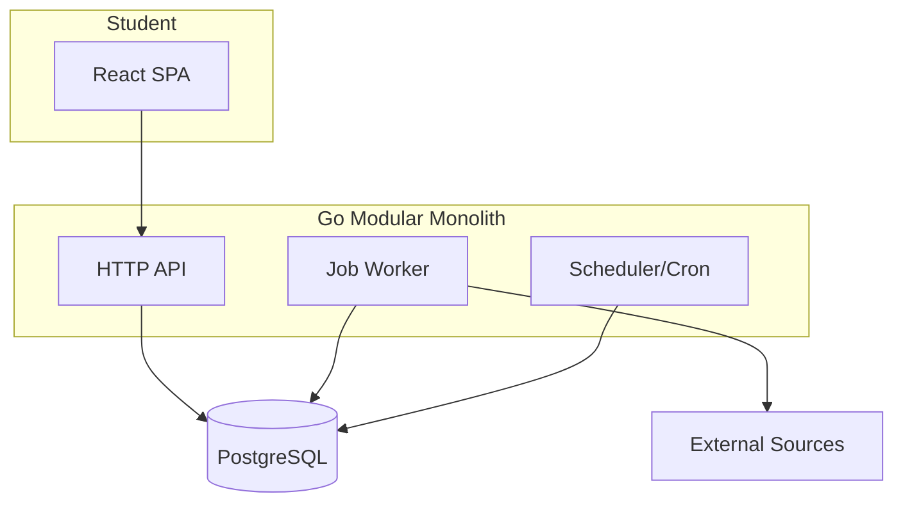

# CareerOS

A career operating system for HBCU students — starting at Grambling State University.

**Discover → Save → Apply → Track → Improve**

CareerOS helps students find internships, jobs, and research programs from verified sources, track applications, and get personalized recommendations — without treating unverified listings as trustworthy.

## Status

**Product v1 complete.** Ready for pilot deployment after platform setup (see [Pilot Readiness](docs/PILOT_READINESS.md)).

## Capabilities

- Unified **Browse** (employment + NSF REU research)
- **For You** deterministic recommendations
- **Saved** opportunities with closed/stale indicators
- **Applications** tracker (employment only)
- Source **freshness** lifecycle (stale/close/reopen with empty-sync safety)
- **Research verification** workflow (award ≠ applications open)
- **Opportunity reporting** + admin console
- Background **jobs**, **notifications**, **ingestion** from USAJobs, Greenhouse, Ashby, Lever, NSF

## Architecture



## Trust model

- **Employment:** `verification_status` + missed-sync stale/close; authoritative reopen on same `(source_id, external_id)`
- **Research:** NSF award verification separate from `application_status` (open/upcoming/unknown/closed)
- **Empty sync:** First zero-result sync is anomalous; second consecutive exhaustive empty confirms genuine emptiness

Details: [Product Completion v1](docs/PRODUCT_COMPLETION_V1.md)

## Local development

```bash
cp .env.example .env
make up              # PostgreSQL + migrations
make api-run         # API on :8080
make web-run         # Frontend on :5173
make worker          # Background worker
make scheduler-once  # One scheduler tick
make ingest          # Run all ingestion sources
make api-test        # Go tests
```

- Frontend: http://localhost:5173 (Vite proxies `/api` to API)
- API health: http://localhost:8080/health
- PostgreSQL: localhost:5433

## Testing

```bash
cd apps/api && go test ./...
cd apps/web && npm ci && npm run build
```

CI: `.github/workflows/ci.yml`

## Deployment

**Recommended:** [Render](https://render.com) — blueprint in [`render.yaml`](render.yaml)

| Compared | Render | Railway | Fly.io |
|----------|--------|---------|--------|
| Static frontend + API + Postgres | ✅ Native | ✅ | ✅ |
| Background worker | ✅ Worker service | ✅ | ✅ Machines |
| Cron scheduler | ✅ Cron jobs | ✅ | ✅ |
| Pilot complexity | **Lowest** | Low | Medium |

Render selected for: single blueprint, free-tier pilot, native cron + worker + static site, minimal ops.

Full runbook: [docs/PILOT_READINESS.md](docs/PILOT_READINESS.md)

## Documentation

| Document | Description |
|----------|-------------|
| [PILOT_READINESS.md](docs/PILOT_READINESS.md) | Deployment & operations |
| [PILOT_PRIVACY.md](docs/PILOT_PRIVACY.md) | Pilot data practices |
| [PRODUCT_COMPLETION_V1.md](docs/PRODUCT_COMPLETION_V1.md) | Product & trust model |
| [ARCHITECTURE.md](docs/ARCHITECTURE.md) | System design |

## Repository structure

```text
careeros/
├── apps/api/          # Go backend
├── apps/web/          # React frontend
├── docs/              # Documentation
├── infrastructure/    # Docker, deployment
├── render.yaml        # Render blueprint
└── scripts/           # Migrations, verify
```
