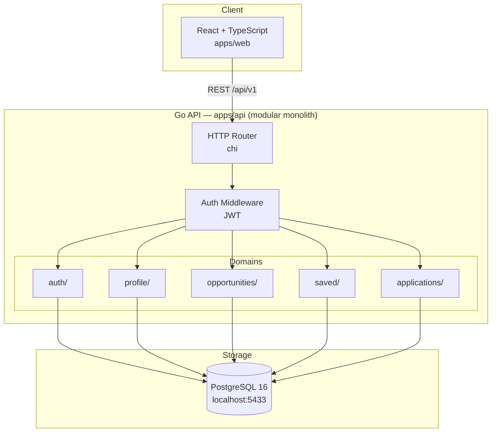
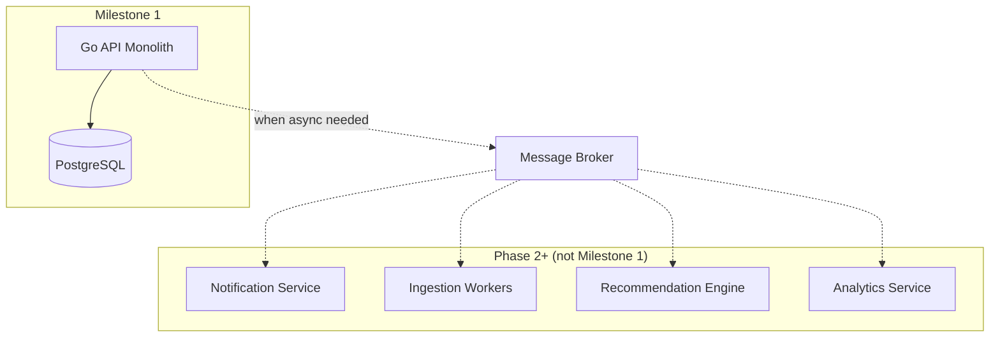

# CareerOS — Architecture

**Status:** Milestone 1  
**Last updated:** 2026-08-29

---

## Overview

CareerOS Milestone 1 is a **modular monolith**: a single Go API service with clear domain boundaries, a React frontend, and PostgreSQL as the sole persistent store. No message brokers, caches, or separate microservices.

---

## Architecture Diagram



---

## Component Boundaries

| Layer | Technology | Responsibility |
|---|---|---|
| Frontend | React + TypeScript + Vite | UI, routing, API client, auth token storage |
| API | Go + chi router | HTTP handling, auth, validation, domain logic |
| Database | PostgreSQL 16 | Persistent storage, constraints, indexes |
| Local orchestration | Docker Compose | PostgreSQL, API, frontend dev server |

---

## Backend Domain Structure

```text
apps/api/
├── cmd/server/          # Entry point
├── internal/
│   ├── config/          # Environment-based configuration
│   ├── db/              # Database connection and migrations runner
│   ├── middleware/       # Logging, auth, recovery, request ID
│   ├── auth/            # Register, login, JWT
│   ├── profile/         # Student profile CRUD
│   ├── opportunities/   # Browse, search, filter, detail
│   ├── saved/           # Save/unsave opportunities
│   ├── applications/    # Application tracker + status history
│   └── platform/        # Health check, error types, response helpers
├── migrations/          # SQL migration files
└── tests/               # Integration tests
```

Each domain package owns its handler, service (business logic), and repository (database queries). Domains do not import each other directly; shared types live in `internal/platform`.

---

## Why Modular Monolith First

| Reason | Explanation |
|---|---|
| **Speed** | One deployable unit; no inter-service networking, no broker setup |
| **Simplicity** | Transactions across domains are straightforward (e.g., status change + history insert) |
| **Correctness** | Fewer failure modes; no distributed consistency problems yet |
| **Product focus** | Students need a working product, not infrastructure |
| **Future extraction** | Domain packages map directly to future microservices if needed |

We will extract services only when a domain has independent scaling, deployment, or reliability requirements that the monolith cannot satisfy.

---

## Authentication Design

**Decision:** JWT (JSON Web Token) with HS256 signing.

| Aspect | Choice | Rationale |
|---|---|---|
| Token type | JWT | Stateless, no session store needed (no Redis) |
| Storage (frontend) | `sessionStorage` | Cleared on tab close; acceptable for MVP local dev |
| Transport | `Authorization: Bearer <token>` header | Standard, simple |
| Expiry | 24 hours (configurable) | Balance security and UX for MVP |
| Password hashing | bcrypt (cost 12) | Industry standard |

**Future evolution:** Move to httpOnly secure cookies when deploying to production with a real domain.

---

## API Design

- RESTful JSON API under `/api/v1`
- Consistent error envelope: `{ "error": { "code": "...", "message": "..." } }`
- Pagination via `?page=1&per_page=20` query params
- Health check at `GET /health` (unversioned)

---

## Database

- PostgreSQL 16 via Docker Compose
- Schema managed by numbered SQL migration files
- `pgx` driver with connection pooling
- All queries parameterized (no string concatenation)

---

## Logging

Structured JSON logs to stdout:

```json
{
  "level": "info",
  "msg": "request completed",
  "request_id": "abc-123",
  "method": "GET",
  "path": "/api/v1/opportunities",
  "status": 200,
  "duration_ms": 12
}
```

---

## Configuration

All configuration via environment variables. See `.env.example` at repository root.

| Variable | Description |
|---|---|
| `DATABASE_URL` | PostgreSQL connection string |
| `JWT_SECRET` | HMAC signing key for JWT |
| `JWT_EXPIRY_HOURS` | Token lifetime (default: 24) |
| `API_PORT` | API listen port (default: 8080) |
| `CORS_ORIGIN` | Allowed frontend origin (default: http://localhost:5173) |
| `LOG_LEVEL` | Log level: debug, info, warn, error |

---

## Future Evolution

The following will be introduced only when product requirements justify them:



| Trigger | Infrastructure to add |
|---|---|
| Deadline reminders needed | Async notification worker + message queue |
| Multiple opportunity sources | Ingestion pipeline + deduplication workers |
| Search performance degrades | Evaluate PostgreSQL full-text search first, then dedicated search |
| API latency on hot reads | Redis caching with measured benefit |
| Independent scaling needed | Extract domain into separate service |
| Production deployment | AWS, observability stack, CI/CD |

---

## Repository Structure

```text
careeros/
├── apps/
│   ├── api/                 # Go backend
│   └── web/                 # React frontend
├── docs/
│   ├── PRODUCT.md
│   ├── REQUIREMENTS.md
│   ├── ARCHITECTURE.md
│   ├── DATA_MODEL.md
│   └── API.md
├── infrastructure/
│   └── docker/
│       └── docker-compose.yml
├── scripts/
│   └── seed.sh              # Development seed data
├── .env.example
├── .gitignore
└── README.md
```
