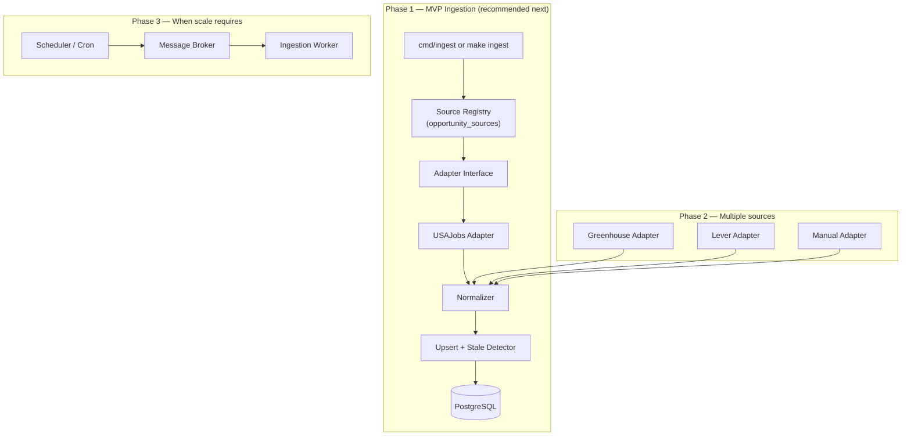

# CareerOS — Opportunity Ingestion Architecture

**Status:** Proposal (pre-implementation)  
**Last updated:** 2026-08-29  
**Replaces:** Development seed data (`000002_seed_dev_data`) for production-facing opportunity catalog

---

## 1. Problem Statement

Milestone 1 uses **development seed data** — manually written sample opportunities labeled `source: manual`. They are useful for testing the product workflow but are **not verified against live postings**. Students cannot trust that a listing is actually open, current, or still accepting applications.

The next priority is a **source-backed ingestion system** that:

1. Pulls opportunities from **legitimate, authorized sources**
2. Attributes every listing to its origin
3. Tracks **when a listing was last verified** against the source
4. **Deduplicates** the same opportunity appearing multiple times
5. **Detects and closes stale listings** that are no longer open
6. Clearly distinguishes **verified** vs **unverified** opportunities in the product

This document proposes the architecture before implementation.

---

## 2. Research Summary — Legitimate Sources

### Tier 1: Recommended for CareerOS (authorized, documented APIs)

| Source | Auth | Coverage | Student relevance | Notes |
|---|---|---|---|---|
| **USAJobs API** | API key (free, application) | US federal jobs & internships | High — Pathways, internships, recent grads | Official government API. `data.usajobs.gov`. Rate limits: 500/page, 10k/query. |
| **Greenhouse Job Board API** | None (read) | Per-company published jobs | High — tech internships | `GET boards-api.greenhouse.io/v1/boards/{token}/jobs`. Requires curated board tokens. |
| **Lever Postings API** | None (read) | Per-company published jobs | High — tech internships | `GET api.lever.co/v0/postings/{slug}?mode=json`. Requires curated site slugs. |

### Tier 2: Viable with registration / partnership

| Source | Auth | Coverage | Notes |
|---|---|---|---|
| **Adzuna API** | app_id + app_key | Aggregated US jobs | Broad but aggregator-quality; good for volume, weaker per-listing authority |
| **Grambling / university feeds** | TBD | Campus-specific | Requires career center partnership; likely manual or RSS initially |
| **TMCF / UNCF programs** | None public | HBCU-focused fellowships | Likely manual curation until official feed exists |

### Tier 3: Explicitly out of scope (per project spec)

- Scraping LinkedIn, Indeed, or Glassdoor without authorized API access
- Bypassing robots.txt, CAPTCHAs, or rate limits
- Presenting unverified data as "live" or "guaranteed open"

### Recommended first source: **USAJobs API**

**Why USAJobs first:**

- Official, authorized, documented REST API
- Free API key via application at [developer.usajobs.gov](https://developer.usajobs.gov)
- Returns structured JSON with title, agency, location, description, application URL, closing date
- Includes internships and Pathways programs relevant to students
- Strong **source attribution** story ("Listed via USAJobs — verified [date]")
- No per-company configuration needed (unlike Greenhouse/Lever)

**Second source (soon after):** Greenhouse or Lever boards for a **curated list** of companies with known HBCU recruiting (e.g., 10–20 board tokens).

---

## 3. Verification Model

Every opportunity has a `verification_status` that tells students how much to trust the listing.

| Status | Meaning | Shown to students? |
|---|---|---|
| `verified` | Fetched from authorized source; seen in latest sync within freshness window | Yes — primary catalog |
| `unverified` | Manual entry, org submission, or pending moderation; not source-backed | Yes — with clear "Unverified" badge |
| `stale` | Was verified but not seen in last N syncs; may still be open | Hidden by default; admin can review |
| `closed` | Past deadline, removed from source, or explicitly closed | No — excluded from browse |

### Freshness rules

| Rule | Action |
|---|---|
| Record appears in latest source sync | Set `last_verified = now()`, `last_seen_at = now()`, status → `verified` |
| Record missing from 2 consecutive syncs | status → `stale` |
| `deadline < today` | status → `closed` |
| Source returns explicit "closed" signal | status → `closed` |
| Manual admin entry | status → `unverified` until reviewed |

### What students see

- **Verified badge:** "Verified via USAJobs · last checked 2 hours ago"
- **Unverified badge:** "Submitted by organization · not independently verified"
- Browse default: `verification_status = verified` AND `status = open`
- Optional filter: "Include unverified" for org-submitted listings

---

## 4. Data Model Changes

### New table: `opportunity_sources`

Registry of ingestion sources.

| Column | Type | Notes |
|---|---|---|
| `id` | UUID PK | |
| `name` | VARCHAR(255) | e.g. "USAJobs", "Greenhouse: Stripe" |
| `source_type` | VARCHAR(50) | `api`, `manual`, `organization_submission` |
| `adapter` | VARCHAR(100) | e.g. `usajobs`, `greenhouse`, `lever`, `manual` |
| `config` | JSONB | Adapter-specific (API keys ref, board token, search params) |
| `enabled` | BOOLEAN | Default true |
| `sync_interval_minutes` | INTEGER | How often to refresh |
| `created_at` | TIMESTAMPTZ | |
| `updated_at` | TIMESTAMPTZ | |

### New table: `ingestion_runs`

Audit log for every sync execution.

| Column | Type | Notes |
|---|---|---|
| `id` | UUID PK | |
| `source_id` | UUID FK | |
| `started_at` | TIMESTAMPTZ | |
| `finished_at` | TIMESTAMPTZ | |
| `status` | VARCHAR(20) | `running`, `success`, `failed` |
| `records_fetched` | INTEGER | |
| `records_created` | INTEGER | |
| `records_updated` | INTEGER | |
| `records_stale` | INTEGER | |
| `records_closed` | INTEGER | |
| `error_message` | TEXT | |

### Extend `opportunities`

| New column | Type | Notes |
|---|---|---|
| `source_id` | UUID FK → opportunity_sources | Nullable for legacy |
| `external_id` | VARCHAR(500) | Source's unique ID for this posting |
| `source_url` | VARCHAR(1000) | Canonical URL at source |
| `verification_status` | VARCHAR(20) | `verified`, `unverified`, `stale`, `closed` |
| `first_seen_at` | TIMESTAMPTZ | When first ingested |
| `last_seen_at` | TIMESTAMPTZ | Last time seen in source feed |
| `last_verified` | TIMESTAMPTZ | Last successful verification (existing column, repurposed) |

**New constraints:**

- `UNIQUE (source_id, external_id)` — one row per source posting
- Index on `(verification_status, status)` for browse queries
- Index on `last_seen_at` for stale detection

### Deprecate development seed data

- Migration marks seed rows `verification_status = unverified`, `source = dev_seed`
- Production browse filters to `verification_status = verified` by default
- Optional: delete seed data entirely after first successful USAJobs sync

---

## 5. Deduplication Strategy

The same opportunity may appear from multiple sources (e.g., a Google internship on USAJobs and on Greenhouse).

### Phase 1 (MVP ingestion): Per-source uniqueness only

- **Primary key:** `(source_id, external_id)` — prevents duplicate imports from same source
- **No cross-source merge** — show separate listings if same job appears twice
- Simpler, auditable, no false merges

### Phase 2: Cross-source deduplication

Match candidates using weighted signals (from project spec):

| Signal | Weight |
|---|---|
| Normalized `application_url` | High |
| `organization_name` + normalized `title` | High |
| Same `deadline` + `location` | Medium |
| Description similarity (pg_trgm) | Low |

- Merge into one canonical opportunity with `opportunity_source_links` table
- Defer until we have real multi-source data to tune rules

---

## 6. Architecture — Phased Approach

### Principle: Modular monolith first, async only when justified

Per project spec, we do **not** introduce Kafka/NATS until product requirements demand it. Ingestion starts as a **sync command** inside the Go monolith.



### Adapter interface (Go)

```go
type SourceAdapter interface {
    Name() string
    Fetch(ctx context.Context, cfg SourceConfig) ([]RawOpportunity, error)
}

type RawOpportunity struct {
    ExternalID      string
    Title           string
    Organization    string
    Description     string
    Category        string
    Location        string
    WorkArrangement string
    Deadline        *time.Time
    ApplicationURL  string
    SourceURL       string
    Compensation    string
    Tags            []string
    Skills          []string
}
```

Each adapter maps source-specific JSON → `RawOpportunity`. The normalizer maps `RawOpportunity` → CareerOS domain model.

### Ingestion pipeline (single run)

```text
1. Load enabled sources from opportunity_sources
2. For each source:
   a. Create ingestion_run (status: running)
   b. Call adapter.Fetch()
   c. For each raw record:
      - Normalize fields (category, work_arrangement enums)
      - Upsert by (source_id, external_id)
      - Set last_seen_at, last_verified, verification_status = verified
   d. Mark records NOT seen this run as stale (if missing 2 runs → stale)
   e. Close records past deadline
   f. Finalize ingestion_run (counts, status)
3. Log structured results
```

### Scheduling

| Environment | Mechanism |
|---|---|
| Local dev | `make ingest` manual command |
| Production (early) | Cron job: `0 */6 * * *` (every 6 hours) |
| Production (later) | Dedicated worker + queue when >5 sources or sync >5 min |

---

## 7. API & Frontend Changes

### Browse query (default)

```sql
WHERE status = 'open'
  AND verification_status = 'verified'
ORDER BY deadline ASC NULLS LAST
```

### Opportunity response additions

```json
{
  "title": "Software Engineering Intern",
  "verification_status": "verified",
  "source": {
    "name": "USAJobs",
    "url": "https://www.usajobs.gov/..."
  },
  "last_verified": "2026-08-29T18:00:00Z",
  "application_url": "https://..."
}
```

### UI badges

- **Verified** (green): "Verified · USAJobs · checked 2h ago"
- **Unverified** (amber): "Not verified — confirm before applying"

---

## 8. Security & Configuration

| Secret | Storage |
|---|---|
| USAJobs API key | `USAJOBS_API_KEY` env var |
| USAJobs user-agent email | `USAJOBS_USER_AGENT` env var |
| Adzuna keys (future) | env vars |
| Greenhouse board tokens | `opportunity_sources.config` (non-secret) |

- Never commit API keys
- `opportunity_sources.config` stores non-sensitive params (search keywords, board tokens, category filters)
- Ingestion command runs server-side only (not exposed to students)

---

## 9. Implementation Plan

### Milestone 2A — Foundation (estimated 1–2 sessions)

1. Schema migration: `opportunity_sources`, `ingestion_runs`, extend `opportunities`
2. Deprecate/hide development seed data from browse
3. Adapter interface + normalizer + upsert logic
4. Stale detection + deadline auto-close
5. `cmd/ingest` CLI command
6. Unit tests for normalizer, dedup, stale logic

### Milestone 2B — First live source (estimated 1–2 sessions)

1. USAJobs adapter (student/internship keyword filters)
2. Register USAJobs in `opportunity_sources`
3. First successful sync replaces seed in student-facing browse
4. Update API responses with `verification_status`, `source`, `last_verified`
5. Update frontend badges and filters
6. Integration test with recorded USAJobs fixture (no live API in CI)

### Milestone 2C — Second source (estimated 1 session)

1. Greenhouse adapter + curated board token list (10 companies)
2. Multi-source ingestion in single `make ingest` run
3. Ingestion run dashboard (admin-only, optional)

### Milestone 2D — Async (only if needed)

Trigger: sync takes >5 minutes, or we need retries/DLQ per project spec Phase 6.

---

## 10. Success Criteria

Ingestion is successful when:

- [ ] Zero development seed data shown in default student browse
- [ ] Every listed opportunity has `source_id`, `external_id`, `last_verified`
- [ ] USAJobs sync runs successfully with real API key
- [ ] Stale listings auto-hidden within 2 missed sync cycles
- [ ] Past-deadline listings auto-closed
- [ ] Students can distinguish verified vs unverified in UI
- [ ] `ingestion_runs` table shows audit trail with counts
- [ ] No scraping of prohibited sources

---

## 11. Open Questions

| Question | Recommendation |
|---|---|
| Which USAJobs filters for students? | Keyword: "intern", "pathways", "student"; categories: IT, engineering |
| Show unverified org submissions in browse? | Yes, with badge, off by default |
| Delete seed data or keep for dev? | Keep in DB with `dev_seed` source, hidden from prod browse |
| How often to sync? | Every 6 hours initially; measure and adjust |
| Admin UI for ingestion? | CLI + `ingestion_runs` table first; admin UI later |

---

## 12. ADR Cross-References

When implementing, create:

- `ADR-008`: USAJobs as first ingestion source
- `ADR-009`: Verification status model
- `ADR-010`: Per-source deduplication (no cross-source merge in MVP)
- `ADR-011`: Sync command vs async worker for ingestion

---

## 13. Recommendation

**Proceed with Milestone 2A + 2B:**

1. Build ingestion foundation in the **modular monolith** (no Kafka)
2. **USAJobs** as first official source
3. **Hide seed data** from student browse immediately
4. Add **verification badges** to API + frontend
5. **Greenhouse** as second source once USAJobs is stable

This delivers real, source-backed opportunities while staying aligned with the project constitution: build complexity only when product requirements justify it.
