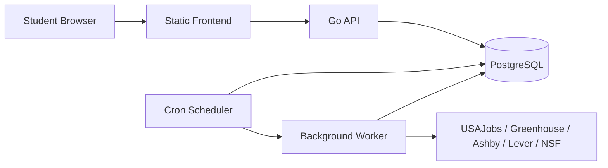

# CareerOS Pilot Readiness Runbook

Operational guide for running the 5–10 student pilot.

## Architecture



| Process | Command | Role |
|---------|---------|------|
| API | `go run ./cmd/server` or Docker `SERVICE=server` | HTTP API, auth, browse |
| Worker | `go run ./cmd/worker` | Job queue processing |
| Scheduler | `go run ./cmd/scheduler -once` (cron) or `go run ./cmd/scheduler` | Enqueue ingestion + reminders |
| Ingest (manual) | `make ingest` | Run all ingestion sources once |

## Production topology (Render — recommended)

| Service | Type | Notes |
|---------|------|-------|
| `careeros-db` | PostgreSQL | Managed database |
| `careeros-api` | Web (Docker) | `/ready` health check |
| `careeros-worker` | Worker (Docker) | Long-running |
| `careeros-scheduler` | Cron (every 6h) | `scheduler -once` |
| `careeros-web` | Static site | SPA with `/* → /index.html` rewrite |

Blueprint: [`render.yaml`](../render.yaml)

## Required environment variables

| Variable | Required | Description |
|----------|----------|-------------|
| `DATABASE_URL` | Yes | PostgreSQL connection string (use `sslmode=require` in prod) |
| `JWT_SECRET` | Yes | ≥16 chars; never use example value in production |
| `CAREEROS_ENV` | Yes | Set `production` in deployed environments |
| `CORS_ORIGIN` | Yes | Exact frontend URL (no `*` in production) |
| `CAREEROS_ADMIN_EMAILS` | Yes | Comma-separated admin emails |
| `COOKIE_SECURE` | Prod | `true` when HTTPS |
| `COOKIE_SAMESITE` | Prod | `None` for cross-origin API + frontend |
| `VITE_API_URL` | Build | API URL baked into frontend at build time |
| `USAJOBS_API_KEY` | Ingest | USAJobs developer key |
| `USAJOBS_USER_AGENT` | Ingest | Contact email per USAJobs policy |
| `METRICS_ENABLED` | No | Default `false` in production |
| `METRICS_TOKEN` | Optional | Bearer token if metrics enabled |

See [`.env.example`](../.env.example).

## Deployment process

1. Create Render account and connect GitHub repo
2. Apply `render.yaml` blueprint (or create services manually)
3. Set sync=false secrets: `CORS_ORIGIN`, `VITE_API_URL`, `CAREEROS_ADMIN_EMAILS`, `USAJOBS_*`
4. Run migrations: `./scripts/migrate.sh up` (pre-deploy on API service)
5. Deploy API → worker → scheduler → frontend (set `VITE_API_URL` before web build)
6. Run initial ingestion: Render shell on worker or one-off job: `make ingest`
7. Verify `/ready`, register pilot student, run smoke test

**Do not** run dev seed in production. Migration `000017` removes legacy dev_seed catalog.

## Migrations

```bash
DATABASE_URL=... ./scripts/migrate.sh up
./scripts/migrate.sh version
./scripts/migrate.sh down   # rollback one step (use with care)
```

Migrations are sequential SQL in `apps/api/migrations/`.

## Health checks

| Endpoint | Semantics |
|----------|-----------|
| `GET /health` | Process alive |
| `GET /ready` | PostgreSQL reachable |

Use `/ready` for load balancer / platform health checks.

## Source health

```bash
make catalog-report    # catalog counts, duplicate audit, source health
make jobs-report       # job queue metrics
curl -H "Authorization: Bearer $ADMIN_JWT" https://api.example.com/api/v1/admin/overview
```

## Logs

Structured JSON logs via `slog`. Each request has `X-Request-ID`. Worker/scheduler set service name in observability defaults.

Passwords and tokens are never logged.

## Common failures

| Symptom | Likely cause | Action |
|---------|--------------|--------|
| `empty_sync_anomaly` | First unexpected zero-result sync | Wait for second consecutive exhaustive empty sync; check board token |
| `incomplete_sync` | Pagination/parse failure | Check provider logs, adapter errors |
| 403 on admin | Email not in `CAREEROS_ADMIN_EMAILS` | Update env, redeploy |
| CORS errors | `CORS_ORIGIN` mismatch | Match exact frontend URL |
| Cookie auth fails cross-origin | `COOKIE_SAMESITE` / `COOKIE_SECURE` | Use `None` + `Secure` with HTTPS |
| No opportunities | Ingestion not run | `make ingest`, check scheduler |

## Opportunity reports

Students submit via detail page → `opportunity_reports` table. Admins review at `/admin` → resolve/dismiss. Reports do not auto-close listings.

## Research verification

NSF award ≠ applications open. Admins verify at `/admin/research`. Unknown programs show program website, not Apply.

## Empty-sync lifecycle

Documented in [`PRODUCT_COMPLETION_V1.md`](PRODUCT_COMPLETION_V1.md). First exhaustive empty sync is anomalous; second consecutive confirms genuine emptiness.

## Backup / recovery

Use managed PostgreSQL backups (Render: automatic daily backups on paid plans; free tier — export manually before major changes). Restore via provider console or `pg_restore`. Application state not in object storage — DB is source of truth.

## Rollback

1. Revert git commit / redeploy previous API image
2. Run `migrate.sh down` only if migration is reversible
3. Do not force-push production DB

## Account deletion (pilot)

Manual operator procedure: delete user row cascades saves, applications, notifications, reports. Script or SQL:

```sql
DELETE FROM users WHERE email = 'student@example.com';
```

## Known pilot limitations

- In-process rate limiting (per-instance; not global across replicas)
- No email/SMS notifications
- Open self-registration (restrict via pilot communication if needed)
- Cross-source duplicate display not suppressed
- Metrics disabled by default in production

## Privacy

See [`PILOT_PRIVACY.md`](PILOT_PRIVACY.md).
