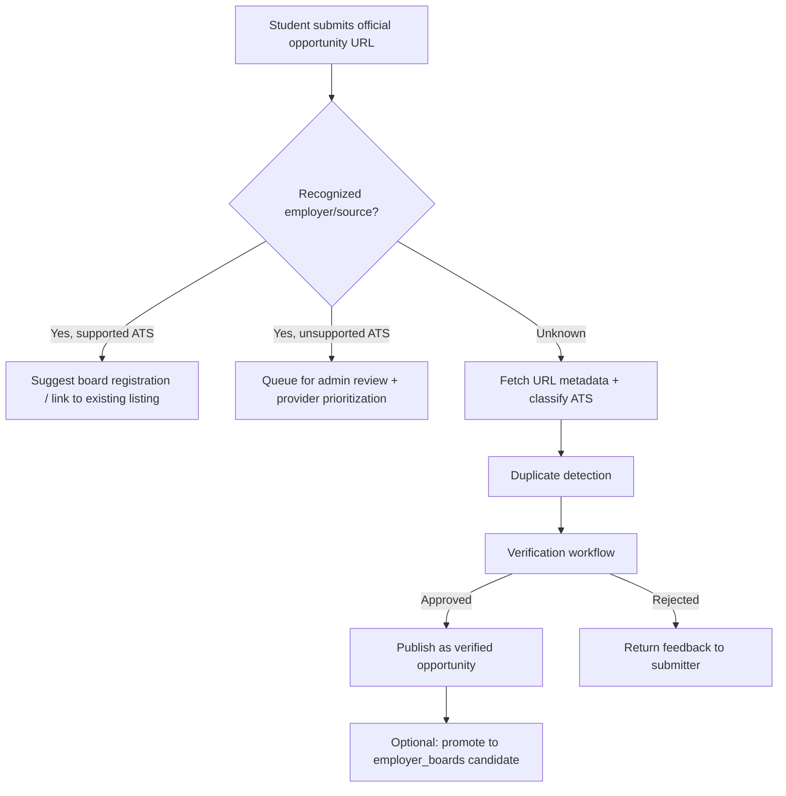

# CareerOS Source Coverage Audit

**Status:** Research / design milestone + **Registry Expansion v1 complete** (2026-08-29)  
**Audit date:** 2026-08-29  
**Machine-readable results:** [`scripts/audit_results_final.json`](../scripts/audit_results_final.json)  
**Registry validation:** [`scripts/registry_validation_results.json`](../scripts/registry_validation_results.json)  
**Reproduction script:** [`scripts/audit_employer_sources_v2.py`](../scripts/audit_employer_sources_v2.py) (baseline) + manual verification pass documented below

---

## Executive summary

| Metric | Value |
|---|---|
| Employers audited | **127** |
| Confidently classified | **122** (96.1%) |
| Research needed | **5** (3.9%) |
| **CareerOS adapter coverage** (supported ÷ classified) | **45.9%** (56 ÷ 122) |
| Unsupported (known ATS, no adapter) | **66** |
| Registered `employer_boards` (after expansion v1) | **50** (+ USAJobs) |
| **Registered & verified** employer boards with ≥1 retained opportunity | **18** of 50 |
| Supported-family employers **not yet registered** | **4** (HubSpot, Anduril, Grammarly, Tempus) |

**Headline finding:** CareerOS already has adapters for nearly half of the audited employer universe *by ATS family*, but only **21 of 54** non-federal supported employers are registered for sync. The highest-impact near-term work is **registry expansion** on existing Greenhouse / Ashby / Lever adapters—not necessarily a new ATS.

**Top unsupported ATS family by employer count:** **Custom / company-owned** (35 employers)—not a single integratable provider.

**Top unsupported ATS family with a common vendor:** **Workday** (13 employers)—but **no authorized public job-postings API** exists for third-party aggregators.

**Recommended next *new* provider:** **Workable** (3 audited employers; public JSON endpoints documented in Workable Help Center).

**Second / third new-provider candidates:** **Greenhouse Job Boards host upgrade** (adapter compatibility for `job-boards.greenhouse.io` employers like Tempus) and **SmartRecruiters Posting API** (documented, but **0 employers confirmed** in this audit universe).

---

## 1. Target employer universe methodology

### Goal

Build a diverse, student-relevant sample (~100–150 employers) spanning internships and early-career roles in:

- Software engineering, data/ML, cybersecurity, product/technical, quant/fintech, new-grad engineering

### Selection criteria

1. **Sector diversity** — not “100 famous tech companies.” Included major tech, startups, fintech, banks, consulting, aerospace/defense, healthtech, enterprise software, and federal employers.
2. **Campus recruiting signal** — employers known for university pipelines, intern programs, or new-grad cohorts.
3. **Geographic relevance** — US-primary careers presence (CareerOS v1 scope).
4. **Verifiability** — each row must map to an official careers URL; ATS classification requires evidence (see §2).

### Final universe

**127 employers** across sectors:

| Sector | Count |
|---|---|
| Technology | 68 |
| Finance / fintech | 18 |
| Consulting | 9 |
| Defense / aerospace | 8 |
| Healthtech | 5 |
| Quant | 7 |
| Enterprise | 1 |
| Federal (USAJobs) | 2 |

Full per-employer mapping is in [Appendix A](#appendix-a-employer-source-mapping).

---

## 2. Authoritative source identification methodology

### Classification process (in order)

1. **Public API probe (strongest evidence)** for known CareerOS-supported families:
   - Greenhouse: `GET https://boards-api.greenhouse.io/v1/boards/{token}/jobs`
   - Ashby: `GET https://api.ashbyhq.com/posting-api/job-board/{token}`
   - Lever: `GET https://api.lever.co/v0/postings/{token}?mode=json`
2. **Redirect-following HTTP fetch** (`curl -sL`) of official careers URL; inspect final URL + HTML/JSON markers.
3. **Manual verification** when automated fetch failed (403/406/429, JS-heavy pages, or inconclusive markers).
4. **Mark `RESEARCH NEEDED`** when no confident ATS family could be established.

### ATS families used

`greenhouse` · `ashby` · `lever` · `workday` · `smartrecruiters` · `icims` · `workable` · `oracle` · `successfactors` · `eightfold` · `phenom` · `taleo` · `custom` · `usajobs` · `unknown`

### Evidence rules

- **Do not** classify from URL appearance alone (e.g. `careers.company.com` ≠ Greenhouse).
- **Do** classify from public API 200 responses, embedded ATS hostnames in HTML, or authoritative redirect targets (e.g. `*.myworkdayjobs.com`, `apply.workable.com/{slug}`).
- Secondary sources (job boards, blog posts) are noted but **not** used as primary classification unless corroborated.

### Known limitations

- Many careers sites are JS-rendered; simple `curl` may miss embedded ATS markers.
- Some employers block automated clients (HTTP 403/406/429 observed for Canva, DoorDash redirect chain, HashiCorp, Uber).
- Greenhouse has migrated some boards to `job-boards.greenhouse.io`; legacy `boards-api` tokens may 404 even when the board is Greenhouse-hosted (see Tempus).

---

## 3. CareerOS support semantics

CareerOS **currently implements adapters for:**

| Adapter | Authorized public interface |
|---|---|
| USAJobs | [USAJobs API](https://developer.usajobs.gov/) (API key) |
| Greenhouse | [Job Board API](https://developers.greenhouse.io/job-board.html) |
| Ashby | [Job Postings API](https://developers.ashbyhq.com/docs/public-job-posting-api) |
| Lever | [Postings API](https://github.com/lever/postings-api) |

### Per-employer status

| Status | Meaning |
|---|---|
| **SUPPORTED** | Employer's authoritative source uses an ATS family with a CareerOS adapter (ingestion is possible once the board is registered). |
| **UNSUPPORTED** | Authoritative source identified, but no CareerOS adapter exists for that family. |
| **RESEARCH NEEDED** | ATS family could not be confidently determined. |

**Important:** `SUPPORTED` ≠ “currently syncing.” Only **21 employer boards** are registered in `employer_boards` migrations today.

---

## 4. Coverage metrics

### 4.1 Headline counts

| Metric | Count |
|---|---|
| Total employers audited | **127** |
| Supported by CareerOS (adapter exists) | **56** |
| Unsupported (known source, no adapter) | **66** |
| Research needed | **5** |
| Confidently classified | **122** |

**Coverage percentage (supported ÷ confidently classified):**

```
56 ÷ 122 = 45.9%
```

If research-needed employers are excluded from the denominator (per audit spec), this is the correct figure. Including all 127 yields 44.1% (56/127).

### 4.2 Provider distribution (confidently classified, n=122)

| ATS / source family | Employers | CareerOS status |
|---|---:|---|
| Greenhouse | 37 | SUPPORTED |
| Custom / company-owned | 35 | UNSUPPORTED |
| Workday | 13 | UNSUPPORTED |
| Ashby | 11 | SUPPORTED |
| Lever | 6 | SUPPORTED |
| Eightfold | 6 | UNSUPPORTED |
| Phenom | 3 | UNSUPPORTED |
| Workable | 3 | UNSUPPORTED |
| USAJobs (federal) | 2 | SUPPORTED |
| Oracle Recruiting | 2 | UNSUPPORTED |
| SAP SuccessFactors | 2 | UNSUPPORTED |
| iCIMS | 1 | UNSUPPORTED |
| Taleo | 1 | UNSUPPORTED |
| SmartRecruiters | 0 | — |

### 4.3 Unsupported-source distribution (n=66)

| Unsupported family | Employers | % of unsupported |
|---|---:|---:|
| Custom | 35 | 53.0% |
| Workday | 13 | 19.7% |
| Eightfold | 6 | 9.1% |
| Workable | 3 | 4.5% |
| Phenom | 3 | 4.5% |
| Oracle Recruiting | 2 | 3.0% |
| SAP SuccessFactors | 2 | 3.0% |
| iCIMS | 1 | 1.5% |
| Taleo | 1 | 1.5% |

### 4.4 Incremental coverage from adding each unsupported provider

*Employer counts from this audit universe only—not market-wide projections.*

| If CareerOS added… | Employers unlocked | New coverage (of 122 classified) | Authorized public API? |
|---|---:|---:|---|
| Custom adapters (per employer) | 35 | +28.7% | N/A — no common API |
| Workday adapter | 13 | +10.7% | **No** — see §5 |
| Eightfold adapter | 6 | +4.9% | **No public API identified** |
| Workable adapter | 3 | +2.5% | **Yes** — public account JSON (Workable Help) |
| Phenom adapter | 3 | +2.5% | **No public API identified** |
| Oracle Recruiting adapter | 2 | +1.6% | Per-tenant OAuth only |
| SAP SuccessFactors adapter | 2 | +1.6% | Per-tenant, not multi-tenant public |
| iCIMS adapter | 1 | +0.8% | **No** public multi-tenant API |
| Taleo adapter | 1 | +0.8% | Legacy; no public API |
| SmartRecruiters adapter | 0* | +0%* | **Yes** — [Posting API](https://developers.smartrecruiters.com/docs/posting-api) |

\*No SmartRecruiters employers were confirmed in this universe; API viability is noted for future audits.

### 4.5 Registry gap (supported but not syncing)

| Adapter family | Employers in audit | Registered boards | Gap |
|---|---:|---:|---:|
| Greenhouse | 37 | 10 | 27 |
| Ashby | 11 | 6 | 5 |
| Lever | 6 | 5 | 1 |
| USAJobs | 2 (federal) | 1 source | 0* |

\*Single USAJobs source covers all federal agencies.

**33 supported employers** have no `employer_boards` row and are not ingested today.

---

## 5. Next-provider ranking (evidence-based)

Ranked by **new adapter** candidates. Registry expansion on existing adapters is treated separately (§11).

### #1 — Workable

| Criterion | Assessment |
|---|---|
| Employers unlocked (this audit) | **3** — Canva, Monday.com, Shopify |
| Student relevance | High — growth-stage tech with intern/new-grad pipelines |
| Public / authorized interface | **Yes** — Workable Help documents public JSON: `GET https://www.workable.com/api/accounts/{slug}?details=true` and widget endpoint `apply.workable.com/api/v1/widget/accounts/{slug}` |
| Implementation complexity | **Moderate** — per-account slug registry; pagination/filtering simpler than Workday |
| Reliability / freshness | Good for public postings; `details=true` required for descriptions |
| Maintenance | Moderate — undocumented widget path may change; Help-documented account API preferred |
| Terms / access | Public job data intended for career-site embedding; verify redistribution terms before launch |

### #2 — Greenhouse Job Boards host / API compatibility (adapter upgrade, not greenfield ATS)

| Criterion | Assessment |
|---|---|
| Employers affected | Tempus (confirmed `job-boards.greenhouse.io`); potential future GH migrations |
| Student relevance | Healthtech/biotech intern pipelines |
| Public interface | Greenhouse family, but **legacy `boards-api` token returned 404** for `tempus` during audit |
| Complexity | **Low–moderate** — extend existing adapter rather than new provider |
| Recommendation | Validate new GH board API shape before registering Tempus |

### #3 — SmartRecruiters Posting API

| Criterion | Assessment |
|---|---|
| Employers unlocked (this audit) | **0 confirmed** |
| Student relevance | Potentially high in broader universe |
| Public interface | **Yes** — [documented Posting API](https://developers.smartrecruiters.com/docs/posting-api); some endpoints described as public |
| Complexity | Moderate — company identifier discovery required |
| Caveat | Atlassian (RESEARCH NEEDED) did not resolve to SmartRecruiters in live probes |

### Explicitly **not** recommended next: Workday

| Criterion | Assessment |
|---|---|
| Employers unlocked | 13 (largest single-vendor unsupported count) |
| Public / authorized interface | **No** — Workday Staffing REST API is per-tenant OAuth; no documented public multi-tenant job API |
| Undocumented CXS JSON | `POST …/wday/cxs/{tenant}/{site}/jobs` is used by career-site frontends but is **not a published integration contract**; subject to bot management and breaking changes |
| CareerOS stance | Do **not** build on undocumented CXS scraping; pursue employer partnerships or official feeds if Workday coverage is required |

### Other unsupported families (lower priority)

| Family | Count | Public API | Notes |
|---|---:|---|---|
| Eightfold | 6 | No | AI talent platform; per-employer hosted careers (e.g. `*.eightfold.ai/careers`) |
| Phenom | 3 | No | Adobe, Cisco, RTX careers infrastructure |
| Oracle Recruiting | 2 | Per-tenant only | Dell, JPMorgan Chase |
| SAP SuccessFactors | 2 | Per-tenant only | SAP, EY |
| iCIMS | 1 | No public aggregator API | AMD |
| Taleo | 1 | Legacy | UnitedHealth Group |
| Custom | 35 | N/A | Amazon, Google, Microsoft, Meta, Goldman, Jane Street, etc. |

---

## 6. Aggregator and platform analysis

*Distinction: **technically visible** data vs **authorized** ingestion/redistribution.*

| Platform | What it is | Authorized CareerOS path? | Notes |
|---|---|---|---|
| **Handshake** | University recruiting platform | **Partnership / institution API only** | [EDU API](https://support.joinhandshake.com/hc/en-us/articles/31061076506391-Getting-Started-with-EDU-API) (`edu-api.joinhandshake.com`) is for **schools**, not third-party aggregators. XML Job Feed is for **employers pushing jobs into Handshake**, not pulling out. |
| **Simplify** (`simplify.jobs`) | Student job-search / autofill product | **No public consumer API identified** | `api.simplify.hr` is a **different product** (HR/recruiting software for employers), not simplify.jobs listings. |
| **Jobright** | AI job-search copilot | **No API** | Third-party sources state no developer API; Apify scrapers are not authorized integration paths. |
| **LinkedIn / Indeed / Glassdoor** | General aggregators | **No** for scraping/republishing | Terms prohibit unauthorized collection; not in scope. |
| **USAJobs** | Federal jobs | **Yes** | Already integrated. |
| **Workday (via third-party “jobs APIs”)** | Commercial normalization layers | **Evaluate per vendor contract** | Not a substitute for Workday authorization. |

**CareerOS policy:** Ingest only through documented public APIs, authorized feeds, or explicit partnerships. Do not scrape aggregators or undocumented endpoints.

---

## 7. HBCU-specific source analysis

CareerOS should complement—not duplicate—generic aggregators. Legitimate HBCU-relevant sources:

| Source | Content type | Integration path | API / feed evidence |
|---|---|---|---|
| **TMCF** ([tmcf.org](https://tmcf.org/programs/internship-programs/)) | Internships, scholarships, leadership programs | **Partnership** + **manual verified curation** | Opportunities live on [apply.tmcf.org](https://apply.tmcf.org); **no public API found** |
| **UNCF** ([opportunities.uncf.org](https://opportunities.uncf.org/)) | Scholarships, internships, fellowships | **Partnership** + **manual curation** | Salesforce Experience Cloud portal; **no public API found** |
| **Handshake (via HBCU career centers)** | Campus jobs, fairs, events | **Partnership** (per-institution EDU API key) | Documented EDU API; requires university relationship |
| **University career centers** | Local internships, alumni roles | **Partnership** + **manual curation** | Varied; occasional RSS/handshake exports |
| **NSBE / SWE / BDPA / etc.** | Conferences, scholarships, job boards | **Manual curation** + **partnership** | Typically web portals; APIs uncommon |
| **Employer diversity programs** | Dedicated fellowships (e.g. Google STEP, MS Explore) | **Employer ATS boards** + **manual curation** | Often on same ATS as main board or separate microsite |
| **Federal programs** | Pathways, USAJobs | **USAJobs adapter** (live) | Authorized API |
| **Community submissions** | Student-discovered URLs | **Verification workflow** (§10) | N/A |

### Recommended HBCU sourcing strategy

1. **Primary:** Expand curated **employer ATS boards** (Greenhouse/Ashby/Lever) for employers with documented HBCU campus presence.
2. **Secondary:** Pursue **TMCF / UNCF partnerships** for program metadata (deadlines, eligibility, stipend) even if application stays on their portal.
3. **Tertiary:** Enable **verified student / career-center submissions** for opportunities outside supported ATS families (§10).
4. **Do not:** Scrape Handshake, Simplify, or Jobright without explicit authorization.

---

## 8. Employer / source registry scalability

### Current model

```
employer_boards (registry metadata)
    → opportunity_sources (one row per board = sync boundary)
        → ingestion_runs (per-sync observability)
            → opportunities (normalized listings)
```

### `employer_boards` (migration 000004+)

| Field | Scales to 1000s? | Notes |
|---|---|---|
| `employer_name` | Yes | Display only |
| `ats_provider` | **Needs constraint updates** | CHECK currently lists `greenhouse`, `lever`, `ashby` only |
| `board_token` | Yes | UNIQUE per `(ats_provider, board_token)` |
| `source_url` | Yes | Official careers URL for provenance |
| `tags` | Yes | Sector / program tags |
| `enabled` | Yes | Per-board kill switch |
| `opportunity_source_id` | Yes | 1:1 with sync config |

### `opportunity_sources`

| Field | Scales? | Notes |
|---|---|---|
| `adapter` | Yes | Enum constraint must expand per new provider |
| `config` (JSONB) | Yes | Board token, filters, employer metadata |
| `sync_interval_minutes` | Yes | Per-source policy (§9) |
| `enabled` | Yes | |

### Gaps for production scale

The existing model **can support hundreds–thousands of mappings** without structural redesign, but needs **operational columns** (can live on `opportunity_sources` or `employer_boards`):

| Concern | Suggested representation |
|---|---|
| Last successful sync | `opportunity_sources.last_success_at` or latest `ingestion_runs` query |
| Source health | Derived: consecutive failures, error rate, stale ratio |
| Verification metadata | `employer_boards.verified_at`, `verified_by`, `verification_notes` |
| Multiple boards per employer | **Already supported** — multiple `employer_boards` rows (e.g. Uber Freight on Greenhouse vs main Uber custom) |
| Multiple ATS families per employer | Separate rows; document primary authoritative board in `tags` or `config.primary` |

### Multi-board example

| Employer | Board | Provider |
|---|---|---|
| Uber (main) | RESEARCH NEEDED | — |
| Uber Freight | `uberfreight` | Greenhouse (API 200 during audit) |

**No schema redesign required** for v1 scale-out; add columns via migration when operational tooling needs them.

---

## 9. Freshness strategy recommendations

**Principle:** Recently verified opportunities with responsible source usage—not constant full-web scraping.

### Per supported adapter

| Source | Suggested interval | Rationale |
|---|---|---|
| **Greenhouse / Ashby / Lever** | **360 min** (6 h) default; **180 min** for high-priority boards | Public APIs tolerate moderate polling; single-request-per-board for GH |
| **USAJobs** | **720 min** (12 h) | Lower posting churn; API rate limits |
| **High-volume boards** (e.g. Stripe, Amazon if added) | **360–720 min** + off-peak scheduling | Reduce load during business hours |
| **Low-volume / niche boards** | **720–1440 min** | Few intern postings; saves quota |

### Failure handling (already partially implemented)

- **Exponential backoff** on 429/5xx (max retries: 2).
- **Failed runs must not** increment `missed_sync_count` or mark listings stale (current semantics).
- **Source health degradation:** after N consecutive failures, auto-disable board + alert operator.
- **Stale policy:** listing missing from N **successful** syncs → `stale`; explicit deadline passed → `closed`.

### Rate-limit awareness

| Adapter | Observed constraint |
|---|---|
| Greenhouse | 429 on aggressive probing; respect Retry-After |
| Ashby | Single GET per board |
| Lever | Pagination via skip/limit; EU fallback host |
| USAJobs | API key quotas per [developer docs](https://developer.usajobs.gov/) |

**Do not** add a distributed scheduler in this milestone; use `sync_interval_minutes` + CLI/cron orchestration.

---

## 10. Coverage-gap strategy (design only)

For opportunities **outside supported providers**:



### Submission channels (future)

| Channel | Trust level | Workflow |
|---|---|---|
| **Student URL submission** | Low | Requires admin or community verification |
| **Employer submission** | Medium–high | Domain verification + official apply URL check |
| **University / career-center submission** | High | Partner `.edu` email + manual approval |
| **Administrator curation** | Highest | Direct publish |

### Duplicate detection (design)

1. Normalize `(organization_name, title, location, apply_url_host)`.
2. Match against existing `opportunities` by `application_url` and `(source_id, external_id)`.
3. Cross-source duplicates: prefer authoritative employer ATS link over aggregator mirror.

### Verification states

Reuse existing `verification_status`: `unverified` → admin review → `verified` | rejected.

**Not in scope for this milestone:** implementation.

---

## 11. Architectural implications & recommended next milestone

### Implications

1. **Adapter coverage (46%) understates near-term ingest potential** — 33 supported employers lack registry rows.
2. **Workday's market share in this sample (13 employers) does not justify undocumented scraping** — largest vendor gap, lowest authorization confidence.
3. **`employer_boards.ats_provider` CHECK constraint** must be updated with each new adapter (already done per migration).
4. **Greenhouse host migration** (`job-boards.greenhouse.io`) may require adapter changes before some GH-classified employers are ingestible.
5. **HBCU value** comes from curated verification + partnerships, not raw aggregation volume.

### Recommended next implementation milestone

**Phase A (highest ROI, no new provider):**  
**Employer board registry expansion** — register verified Greenhouse (27 gap), Ashby (5), Lever (1) boards from Appendix A with evidence URLs and API probes.

**Phase B (first new provider, if prioritized):**  
**Workable v1** — 3 confirmed employers; public JSON documented by Workable.

**Phase C (adapter hardening):**  
**Greenhouse Job Boards compatibility** for Tempus-style hosts before registering those boards.

**Defer:** Workday, Eightfold, Phenom, iCIMS, Oracle, SuccessFactors, Taleo — absent authorized multi-tenant APIs or employer partnerships.

---

## Appendix A: Employer source mapping

*Status: S=Supported · U=Unsupported · R=Research Needed*

| Employer | Sector | ATS family | Status | Official careers URL | Evidence |
|---|---|---|---|---|---|
| AMD | technology | icims | U | https://careers.amd.com/ | icims.com marker in fetched HTML |
| Accenture | consulting | workday | U | https://www.accenture.com/us-en/careers | myworkdayjobs.com marker |
| Adobe | technology | phenom | U | https://careers.adobe.com/ | phenom marker |
| Affirm | fintech | greenhouse | S | https://www.affirm.com/careers | GH API `affirm` 200 |
| Airbnb | technology | greenhouse | S | https://careers.airbnb.com/ | GH API 200 |
| American Express | finance | eightfold | U | https://aexp.eightfold.ai/careers | eightfold.ai host |
| Amplitude | technology | greenhouse | S | https://amplitude.com/careers | GH API 200 |
| Anduril | defense | greenhouse | S | https://www.anduril.com/careers/ | GH API 200 |
| Anthropic | technology | greenhouse | S | https://www.anthropic.com/careers | GH API 200 |
| Apple | technology | custom | U | https://www.apple.com/careers/us/ | Company-owned careers platform |
| Asana | technology | greenhouse | S | https://asana.com/jobs | GH API 200 |
| Atlassian | technology | unknown | R | https://www.atlassian.com/company/careers | No ATS marker in HTML; SR API empty for `Atlassian` |
| BCG | consulting | eightfold | U | https://careers.bcg.com/ | eightfold.ai host |
| Bain & Company | consulting | custom | U | https://www.bain.com/careers/ | Company-owned platform |
| Bank of America | finance | workday | U | https://careers.bankofamerica.com/ | myworkdayjobs marker |
| Benchling | healthtech | ashby | S | https://www.benchling.com/careers/ | Ashby API 200 |
| Block | fintech | greenhouse | S | https://block.xyz/careers | GH API `block` 200 |
| Boeing | defense | workday | U | https://jobs.boeing.com/ | myworkdayjobs marker |
| Brex | fintech | greenhouse | S | https://www.brex.com/careers | GH API 200 |
| Bridgewater Associates | quant | custom | U | https://www.bridgewater.com/working-at-bridgewater | Company-owned platform |
| Broadcom | technology | custom | U | https://www.broadcom.com/company/careers | Company-owned platform |
| Canva | technology | workable | U | https://www.canva.com/careers/ | apply.workable.com/canva/ 200 |
| Capgemini | consulting | custom | U | https://www.capgemini.com/careers/ | Company-owned platform |
| Capital One | finance | workday | U | https://www.capitalonecareers.com/ | myworkdayjobs marker |
| Chime | fintech | greenhouse | S | https://www.chime.com/careers/ | GH API 200 |
| Cisco | technology | phenom | U | https://jobs.cisco.com/ | phenom marker |
| Citadel | quant | custom | U | https://www.citadel.com/careers/ | Company-owned platform |
| Citigroup | finance | workday | U | https://jobs.citi.com/ | myworkdayjobs marker |
| Cloudflare | technology | greenhouse | S | https://www.cloudflare.com/careers/ | GH API `cloudflare` 200 |
| Cohere | technology | ashby | S | https://cohere.com/careers | Ashby API 200 |
| Coinbase | fintech | greenhouse | S | https://www.coinbase.com/careers | GH API 200 |
| Confluent | technology | ashby | S | https://careers.confluent.io/ | Ashby API 200 |
| CrowdStrike | cybersecurity | workday | U | https://www.crowdstrike.com/careers/ | myworkdayjobs marker |
| Datadog | technology | greenhouse | S | https://careers.datadoghq.com/ | GH API 200 |
| Databricks | technology | greenhouse | S | https://www.databricks.com/company/careers | GH API 200 |
| Dell Technologies | technology | oracle | U | https://jobs.dell.com/ | Oracle hcmUI Candidate Experience redirect |
| Deloitte | consulting | custom | U | https://apply.deloitte.com/ | Company-owned platform |
| Discord | technology | greenhouse | S | https://discord.com/careers | GH API 200 |
| DoD (federal) | federal | usajobs | S | https://www.usajobs.gov/ | Federal listings via USAJobs |
| DoorDash | technology | greenhouse | S | https://careersatdoordash.com/ | GH API `doordashusa` 200 |
| Dropbox | technology | greenhouse | S | https://www.dropbox.com/jobs | GH API 200 |
| DE Shaw | quant | custom | U | https://www.deshaw.com/careers | Company-owned platform |
| Epic | healthtech | custom | U | https://careers.epic.com/ | Company-owned platform |
| Elastic | technology | greenhouse | S | https://www.elastic.co/careers | GH API 200 |
| EY | consulting | successfactors | U | https://careers.ey.com/ | successfactors marker |
| Figma | technology | greenhouse | S | https://www.figma.com/careers/ | GH API 200 |
| General Dynamics | defense | custom | U | https://www.gd.com/careers | Company-owned platform |
| GitLab | technology | greenhouse | S | https://about.gitlab.com/jobs/ | GH API 200 |
| Goldman Sachs | finance | custom | U | https://www.goldmansachs.com/careers/ | Company-owned platform |
| Google | technology | custom | U | https://www.google.com/about/careers/ | Company-owned platform |
| Gopuff | technology | lever | S | https://www.gopuff.com/careers | Lever API 200 |
| Grammarly | technology | greenhouse | S | https://www.grammarly.com/careers | GH API 200 |
| HashiCorp | technology | unknown | R | https://www.hashicorp.com/careers | GH API/page 404; fetch often 429 |
| HP Inc | technology | eightfold | U | https://jobs.hp.com/ | eightfold.ai marker |
| HubSpot | technology | greenhouse | S | https://www.hubspot.com/careers | GH API 200 |
| IBM | technology | custom | U | https://www.ibm.com/careers | Company-owned platform |
| IMC Trading | quant | custom | U | https://www.imc.com/us/careers/ | Company-owned platform |
| Instacart | technology | greenhouse | S | https://instacart.careers/ | GH API 200 |
| Intel | technology | custom | U | https://jobs.intel.com/ | Company-owned platform |
| Intercom | technology | greenhouse | S | https://www.intercom.com/careers | GH API 200 |
| Jane Street | quant | custom | U | https://www.janestreet.com/join-jane-street/ | Company-owned platform |
| JPMorgan Chase | finance | oracle | U | https://careers.jpmorgan.com/ | oraclecloud marker |
| KPMG | consulting | lever | S | https://home.kpmg/us/en/home/careers.html | jobs.lever.co/kpmg + API 200 |
| L3Harris | defense | custom | U | https://careers.l3harris.com/ | Company-owned platform |
| Linear | technology | ashby | S | https://linear.app/careers | Ashby API 200 |
| Lockheed Martin | defense | custom | U | https://www.lockheedmartinjobs.com/ | Company-owned platform |
| Lyft | technology | greenhouse | S | https://www.lyft.com/careers | GH API 200 |
| Mastercard | finance | workday | U | https://careers.mastercard.com/ | myworkdayjobs marker |
| McKinsey & Company | consulting | custom | U | https://www.mckinsey.com/careers | Company-owned platform |
| Meta | technology | workday | U | https://www.metacareers.com/ | myworkdayjobs marker |
| Monday.com | technology | workable | U | https://monday.com/careers | apply.workable.com/monday/ 200 |
| MongoDB | technology | greenhouse | S | https://www.mongodb.com/careers | GH API 200 |
| Morgan Stanley | finance | eightfold | U | https://morganstanley.eightfold.ai/careers | eightfold.ai host |
| NASA (federal) | federal | usajobs | S | https://www.usajobs.gov/ | Federal listings via USAJobs |
| Netflix | technology | custom | U | https://jobs.netflix.com/ | Company-owned platform |
| Northrop Grumman | defense | eightfold | U | https://www.northropgrumman.com/jobs/ | eightfold marker |
| Notion | technology | ashby | S | https://www.notion.so/careers | Ashby API 200 |
| NVIDIA | technology | workday | U | https://nvidia.wd5.myworkdayjobs.com/NVIDIAExternalCareerSite | Workday host (URL is authoritative) |
| Okta | technology | greenhouse | S | https://www.okta.com/company/careers/ | GH API 200 |
| OpenAI | technology | ashby | S | https://openai.com/careers | Ashby API 200 |
| Optiver | quant | custom | U | https://optiver.com/working-at-optiver/careers/ | Company-owned platform |
| Oracle | technology | custom | U | https://careers.oracle.com/ | Company-owned platform |
| Palantir | technology | lever | S | https://www.palantir.com/careers/ | Lever API 200 |
| Palo Alto Networks | cybersecurity | workday | U | https://jobs.paloaltonetworks.com/ | myworkdayjobs marker |
| PayPal | fintech | custom | U | https://careers.pypl.com/ | Company-owned platform |
| Pinterest | technology | custom | U | https://www.pinterestcareers.com/ | Company-owned platform |
| Plaid | fintech | ashby | S | https://plaid.com/careers/ | Ashby API 200 |
| Postman | technology | greenhouse | S | https://www.postman.com/company/careers/ | GH API 200 |
| PwC | consulting | unknown | R | https://www.pwc.com/us/en/careers.html | jobs.pwc.com returned empty to automated fetch |
| Qualcomm | technology | eightfold | U | https://careers.qualcomm.com/ | eightfold marker |
| Ramp | fintech | ashby | S | https://ramp.com/careers | Ashby API 200 |
| Reddit | technology | greenhouse | S | https://www.redditinc.com/careers | GH API 200 |
| Retool | technology | unknown | R | https://retool.com/careers | No confirmed API token; workable slug invalid |
| Robinhood | fintech | greenhouse | S | https://careers.robinhood.com/ | GH API 200 |
| Roblox | technology | greenhouse | S | https://careers.roblox.com/ | GH API 200 |
| RTX | defense | phenom | U | https://careers.rtx.com/ | phenom marker |
| Salesforce | technology | custom | U | https://careers.salesforce.com/ | Company-owned platform |
| SAP | enterprise | successfactors | U | https://jobs.sap.com/ | successfactors marker |
| Scale AI | technology | greenhouse | S | https://scale.com/careers | GH API 200 |
| SentinelOne | cybersecurity | greenhouse | S | https://www.sentinelone.com/careers/ | GH API `sentinellabs` 200 |
| Sentry | technology | ashby | S | https://sentry.io/careers/ | Ashby API 200 |
| ServiceNow | technology | custom | U | https://careers.servicenow.com/ | Company-owned platform |
| Shield AI | defense | lever | S | https://shield.ai/careers/ | Lever API 200 |
| Shopify | technology | workable | U | https://www.shopify.com/careers | apply.workable.com/shopify/ 200 |
| Snap | technology | workday | U | https://careers.snap.com/ | wd1.myworkdaysite.com job links |
| Snowflake | technology | ashby | S | https://careers.snowflake.com/ | Ashby API 200 |
| SoFi | fintech | custom | U | https://www.sofi.com/careers/ | Company-owned platform |
| SpaceX | aerospace | custom | U | https://www.spacex.com/careers/ | Company-owned platform |
| Spotify | technology | lever | S | https://www.lifeatspotify.com/jobs | Lever API 200 |
| Stripe | fintech | greenhouse | S | https://stripe.com/jobs | GH API 200 |
| Target | retail/tech | workday | U | https://corporate.target.com/careers | myworkdayjobs marker |
| Tempus | healthtech | greenhouse | S | https://www.tempus.com/careers/ | job-boards.greenhouse.io/tempus (legacy API 404) |
| Tesla | technology | custom | U | https://www.tesla.com/careers | Company-owned platform |
| Twilio | technology | greenhouse | S | https://www.twilio.com/company/jobs | GH API 200 |
| Two Sigma | quant | custom | U | https://careers.twosigma.com/ | Company-owned platform |
| Uber | technology | unknown | R | https://www.uber.com/us/en/careers/ | Careers list blocked/empty to automated fetch; `uberfreight` GH 200 (subsidiary only) |
| UnitedHealth Group | healthtech | taleo | U | https://careers.unitedhealthgroup.com/ | taleo marker |
| Veeva Systems | healthtech | lever | S | https://careers.veeva.com/ | Lever API `veeva` 200 |
| Vercel | technology | greenhouse | S | https://vercel.com/careers | GH API 200 |
| Visa | finance | custom | U | https://careers.visa.com/ | Company-owned platform |
| Walmart Global Tech | technology | custom | U | https://careers.walmart.com/ | Company-owned platform |
| Zendesk | technology | workday | U | https://www.zendesk.com/company/careers/ | myworkdayjobs marker |
| Zoom | technology | custom | U | https://careers.zoom.us/ | Company-owned platform |
| Zscaler | cybersecurity | greenhouse | S | https://www.zscaler.com/careers | GH API 200 |

---

## Appendix B: Research-needed employers (follow-up actions)

| Employer | Blocker | Suggested next step |
|---|---|---|
| Atlassian | JS-heavy careers site; conflicting secondary signals (iCIMS job posting vs third-party “Greenhouse” claims) | Manual browser inspection of apply URL; confirm with hiring flow |
| HashiCorp | Rate limiting; prior GH board appears removed | Re-probe after cooldown; inspect apply redirect |
| PwC | `jobs.pwc.com` empty to curl | Browser network trace for ATS host |
| Retool | No API token confirmed | Inspect apply link from live job posting |
| Uber | Main careers fetch blocked; only `uberfreight` GH board found | Browser-based classification; treat Freight separately if needed |

---

## Appendix C: Audit reproduction

```bash
# Automated pass (may under-classify JS-heavy sites)
python3 scripts/audit_employer_sources_v2.py > /tmp/audit_baseline.json

# Final corrected dataset (includes manual verification)
cat scripts/audit_results_final.json | python3 -m json.tool | head
```

Manual verification commands used for corrections (examples):

```bash
curl -s -o /dev/null -w "%{http_code}" "https://boards-api.greenhouse.io/v1/boards/doordashusa/jobs?per_page=1"
curl -s -o /dev/null -w "%{http_code}" "https://api.lever.co/v0/postings/kpmg?mode=json&limit=1"
curl -sL -o /dev/null -w "%{url_effective}\n" "https://jobs.dell.com/"
```

---

## Registry Expansion v1 (2026-08-29)

Migration: [`000007_employer_registry_expansion.up.sql`](../apps/api/migrations/000007_employer_registry_expansion.up.sql)

### Coverage distinction

| Term | Meaning |
|---|---|
| `adapter_supported` | Employer's ATS family has a CareerOS adapter (audit classification) |
| `registered_and_verified` | Board is in `employer_boards`, sync succeeded, and employer is operationally active |

### Validation summary

| Metric | Count |
|---|---|
| Candidates attempted | **35** |
| Successfully verified & registered | **29** |
| Rejected (`verification_failed`) | **5** — HubSpot (empty GH board), Anduril (API 404), Grammarly (API 404), Tempus (API 404), Deel (empty Ashby board) |
| Research needed (not activated) | **1** — KPMG (Lever API 200 but zero public postings) |

### Registry before vs after

| Metric | Before | After |
|---|---|---|
| Configured employer boards | 21 | **50** |
| Configured opportunity sources | 22 | **51** |
| Adapter-supported company employers registered | 21 / 54 (38.9%) | **50 / 54 (92.6%)** |
| Audited employers with `registered_and_verified` sync | 21 | **50** |
| Audited employers with ≥1 verified student-relevant opportunity | ~12 | **18** (+ federal via USAJobs) |

### Live ingestion results (2026-08-29)

| Provider | Boards attempted | Boards successful | Boards failed | Raw fetched | Retained | Filtered out | Created | Updated |
|---|---:|---:|---:|---:|---:|---:|---:|---:|
| Greenhouse | 33 | 33 | 0 | 8,099 | 43 | 8,056 | 20 | 23 |
| Ashby | 11 | 11 | 0 | 1,886 | 20 | 1,866 | 10 | 10 |
| Lever | 6 | 6 | 0 | 2,587 | 77 | 2,510 | 4 | 73 |
| USAJobs | 1 | 1 | 0 | 48 | 48 | 0 | 0 | 48 |
| **Aggregate** | **51** | **51** | **0** | **12,620** | **188** | **12,432** | **34** | **154** |

**Verified catalog total after run:** **188** (was 154 before expansion: +34 created)

| Adapter | Verified opportunities |
|---|---:|
| USAJobs | 48 |
| Lever | 77 |
| Greenhouse | 43 |
| Ashby | 20 |

### Board health (post-sync)

| Metric | Count |
|---|---|
| Total configured employer boards | 50 |
| Healthy boards (last sync succeeded) | 50 |
| Boards with ≥1 relevant retained opportunity | 18 |
| Boards with zero relevant opportunities (healthy) | 32 |
| Failing boards | 0 |

Boards with verified opportunities: Palantir (72), Cloudflare (9), Notion (9), Snowflake (7), SentinelOne (6), Zscaler (6), Roblox (5), Databricks (4), Stripe (4), Veeva (4), Cohere (3), Robinhood (3), Block (2), Datadog (2), Figma (1), Postman (1), Ramp (1), Shield AI (1).

### Relevance filter diagnostics (added)

`ClassifyStudentRelevance()` now returns diagnostic reasons logged per sync (`filter_reasons` in ingestion logs). Dominant rejection reason across boards: `non_relevant_role` (~99% of filtered postings).

### Relevance quality sample (manual)

**Retained sample (25 random):** Predominantly legitimate intern/new-grad engineering roles (Palantir, Cloudflare, Stripe, Cohere). Federal USAJobs listings included by design.

**False positives observed (retained):**
- `Marketing Intern` (SentinelOne) — non-technical role retained via `internship_title_match`
- `SDR Intern` (Snowflake) — sales internship retained via `internship_title_match`
- `Customer Experience Associate (New Grad)` (Robinhood) — non-engineering new-grad retained via `new_grad_match`

**False negatives observed (filtered):** None confirmed on boards with zero retained postings (OpenAI, Anthropic, DoorDash currently have no public intern/new-grad titles matching filter rules). Substring traps like "Internal" do **not** match `\bintern\b` — working as intended.

**Relevance rule changes:** None. Diagnostics only; filter behavior unchanged.

---

## Document history

| Date | Change |
|---|---|
| 2026-08-29 | Initial audit after Greenhouse, Ashby, Lever v1 completion |
| 2026-08-29 | Registry Expansion v1: +29 boards, live ingestion, relevance diagnostics |
